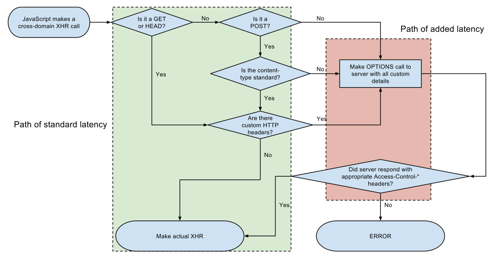
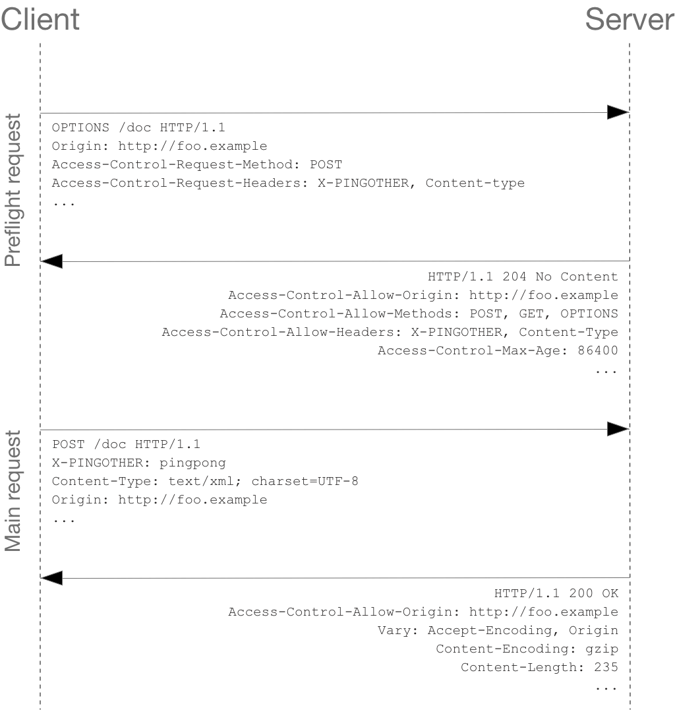
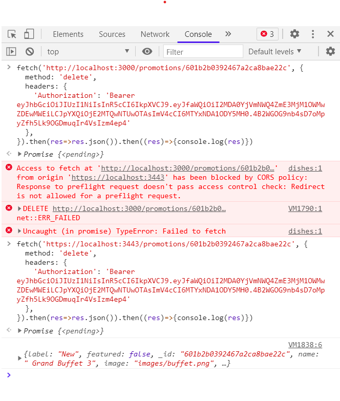
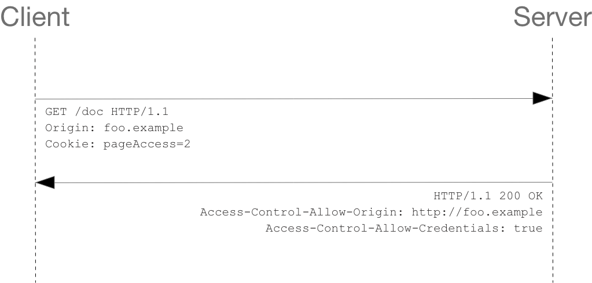
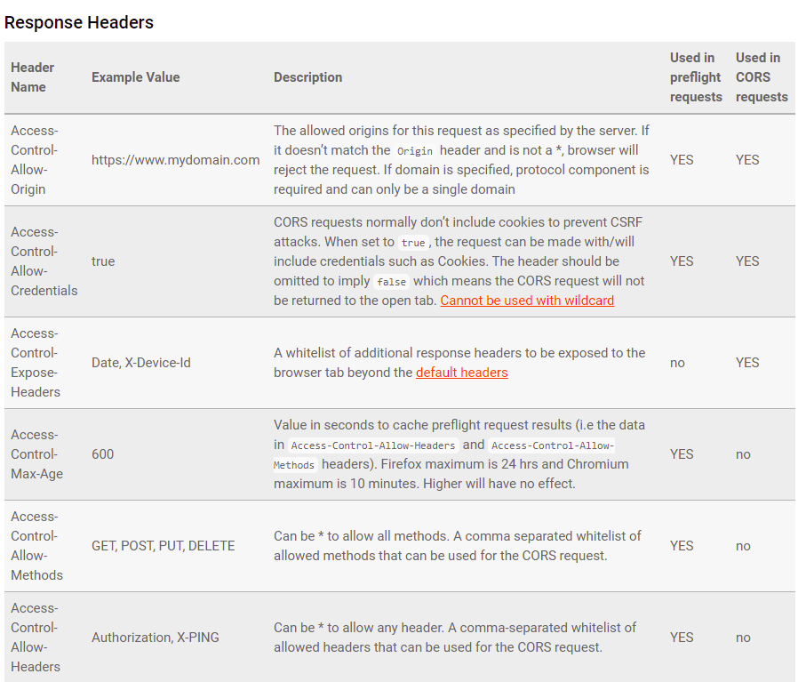
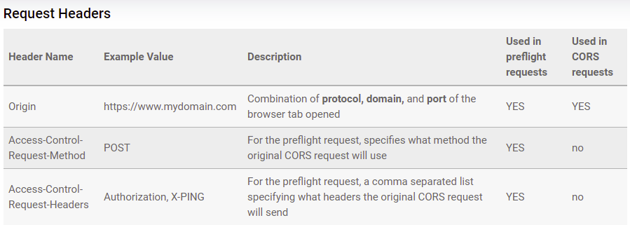

# CORS

Cross-Origin Resource Sharing (CORS) is an HTTP-header based mechanism that allows a server to indicate any other origins (domain, scheme, or port) than its own from which a browser should permit loading of resources.

A web page may freely embed cross-origin images, stylesheets, scripts, iframes, and videos. Certain "cross-domain" requests, notably Ajax/XMLHttpRequest/Fetch requests, are forbidden by default by the same-origin security policy.

CORS defines a way in which a browser and server can interact to determine whether it is safe to allow the cross-origin request. It allows for more freedom and functionality than purely same-origin requests, but is more secure than simply allowing all cross-origin requests.

CORS also relies on a mechanism by which browsers make a “preflight” request to the server hosting the cross-origin resource, in order to check that the server will permit the actual request. In that preflight, the browser sends headers that indicate the HTTP method and headers that will be used in the actual request.

An example of a cross-origin request: the front-end JavaScript code served from `https://domain-a.com` uses XMLHttpRequest to make a request for `https://domain-b.com/data.json`.

### What requests use cors?

<hr width='50%' style=" float: left;" ><br>

- Invocations of the XMLHttpRequest or Fetch APIs.
- Web Fonts (for cross-domain font usage in @font-face within CSS), so that servers can deploy TrueType fonts that can only be cross-site loaded and used by web sites that are permitted to do so.
- WebGL textures.
- Images/video frames drawn to a canvas using drawImage().
- CSS Shapes from images.

<br>

# How does CORS works?

The Cross-Origin Resource Sharing standard works by adding new HTTP headers that let servers describe which origins are permitted to read that information from a web browser. Additionally, for HTTP request methods that can cause side-effects on server data (in particular, HTTP methods other than GET, or POST with certain MIME types), the specification mandates that browsers "preflight" the request, soliciting supported methods from the server with the HTTP `OPTIONS` request method, and then, upon "approval" from the server, sending the actual request. Servers can also inform clients whether "credentials" (such as Cookies and HTTP Authentication) should be sent with requests.

CORS failures result in errors, but for security reasons, specifics about the error are not available to JavaScript. All the code knows is that an error occurred. The only way to determine what specifically went wrong is to look at the browser's console for details.

There are two types of CORS requests, simple requests and preflighted requests.

## Simple Request

<hr width='50%' style=" float: left;" ><br>

Simple requests don’t trigger a CORS preflight.
The browser deems the request to be a "simple" request when the request itself meets a certain set of requirements:

- One of these methods is used: GET, POST, or HEAD

- A CORS safe-listed header is used

  - Accept
  - Accept-Language
  - Content-Language
  - Content-Type (additional requirements)

- When using the Content-Type header, only the following values are allowed:

  - application/x-www-form-urlencoded
  - multipart/form-data
  - text/plain

- No event listeners are registered on any XMLHttpRequest.upload object
- No ReadableStream object is used in the request

The request is allowed to continue as normal if it meets these criteria, and the Access-Control-Allow-Origin header is checked when the response is returned.

### Example 1

<hr width='30%' style=" float: left;" ><br>

Suppose a user visits `http://www.example.com` and the page attempts a cross-origin request to fetch the user's data from `http://service.example.com`. A CORS-compatible browser will attempt to make a cross-origin request to `service.example.com` as follows.

1. The browser sends the GET request with an extra Origin HTTP header to `service.example.com` containing the domain that served the parent page:

```
   Origin: http://www.example.com
```

2. The server at `service.example.com` may respond with:

   - The requested data along with an Access-Control-Allow-Origin (ACAO) header in its response indicating the requests from the origin are allowed. For example in this case it should be:

     ```
     Access-Control-Allow-Origin: http://www.example.com
     ```

   - The requested data along with an Access-Control-Allow-Origin (ACAO) header with a wildcard indicating that the requests from all domains are allowed:

   ```
     Access-Control-Allow-Origin: *
   ```

   - An error page if the server does not allow a cross-origin request

### Example 2

<hr width='30%' style=" float: left;" ><br>

For example, suppose web content at `https://foo.example` wishes to invoke content on domain `https://bar.other`. Code of this sort might be used in JavaScript deployed on foo.example

```
const xhr = new XMLHttpRequest();
const url = 'https://bar.other/resources/public-data/';

xhr.open('GET', url);
xhr.onreadystatechange = someHandler;
xhr.send();
```

This performs a simple exchange between the client and the server, using CORS headers to handle the privileges:


<br><br>

A wildcard same-origin policy is appropriate when a page or API response is considered completely public content and it is intended to be accessible to everyone, including any code on any site. A freely-available web font on a public hosting service like Google Fonts is an example.

The value of "\*" is special in that it does not allow requests to supply credentials, meaning it does not allow HTTP authentication, client-side SSL certificates, or cookies to be sent in the cross-domain request
When responding to a credentialed requests request, the server must specify an origin in the value of the Access-Control-Allow-Origin header, instead of specifying the "\*" wildcard.

<br>

## Preflight Request (OPTIONS)

<hr width='50%' style=" float: left;" ><br>

Unlike “simple requests” (discussed above), for "preflighted" requests the browser first sends an HTTP request using the OPTIONS method to the resource on the other origin, in order to determine if the actual request is safe to send. Cross-site requests are preflighted like this since they may have implications to user data.

The preflight request sets the mode/method as OPTIONS and sets a couple of headers to describe the actual request that is to follow :

- `Access-Control-Request-Method` : The intended method of the request (e.g., GET or POST)
- `Access-Control-Request-Headers` : An indication of the custom headers that will be sent with the request
- `Origin` : The usual origin header that contains the script's current origin

The server will include some Access-Control-\* headers within the response to indicate whether the request that follows will be allowed or not. These include:

- `Access-Control-Allow-Origin` : The origin that is allowed to make the request, or \* if a request can be made from any origin
- `Access-Control-Allow-Methods` : A comma-separated list of HTTP methods that are allowed
- `Access-Control-Allow-Headers` : A comma-separated list of the custom headers that are allowed to be sent
- `Access-Control-Max-Age` : The maximum duration that the response to the preflight request can be cached before another call is made

The response would then be examined by the browser to decide whether to continue with the request or to abandon it.

Typical cases requiring preflighted requests:

- A website makes an AJAX call to POST JSON data to a REST API meaning the `Content-Type header` is `application/json`

- A website makes an AJAX call to an API which uses a token to authenticate the API in a request header such `Authorization`

<br>

### Example 1

<hr width='30%' style=" float: left;" ><br>

Suppose a user visits `http://www.example.com` and the page attempts a cross-origin PUT request to update the user's data at `http://service.example.com`. A CORS-compatible browser will initiate an extra "preflight" request as PUT method is used to determine whether they have permission to perform the action at `service.example.com`.

1. Browser will preflight this request as PUT method is used and send an OPTIONS request to the server, in order to determine if the actual request is safe to send.

   ```
   OPTIONS /
   Host: service.example.com
   Origin: http://www.example.com
   Access-Control-Request-Method: PUT
   ```

2. If `service.example.com` is willing to accept the action, it may respond with the following headers:

   ```
   Access-Control-Allow-Origin: http://www.example.com
   Access-Control-Allow-Methods: PUT, DELETE
   ```

3. The browser will then make the actual request. If `service.example.com` does not accept cross-site requests from this origin then it will respond with error to the OPTIONS request and the browser will not make the actual request.

   Below diagram shows when browser make a preflight request -

   

### Example 2

<hr width='30%' style=" float: left;" ><br>

The example below creates an XML body to send with the POST request. Also, a non-standard HTTP X-PINGOTHER request header is set. Such headers are not part of HTTP/1.1, but are generally useful to web applications. Since the request uses a Content-Type of application/xml, and since a custom header is set, this request is preflighted

```
const xhr = new XMLHttpRequest();
xhr.open('POST', 'https://bar.other/resources/post-here/');
xhr.setRequestHeader('X-PINGOTHER', 'pingpong');
xhr.setRequestHeader('Content-Type', 'application/xml');
xhr.onreadystatechange = handler;
xhr.send('<person><name>Arun</name></person>');
```

<br>



- OPTIONS Request

  The browser determines that it needs to send OPTIONS request based on the request parameters that the JavaScript code snippet above was using, so that the server can respond whether it is acceptable to send the request with the actual request parameters. OPTIONS is an HTTP/1.1 method that is used to determine further information from servers, and is a safe method, meaning that it can't be used to change the resource. Note that along with the OPTIONS request, two other request

  The `Access-Control-Request-Method` header notifies the server as part of a preflight request that when the actual request is sent, it will be sent with a `POST` request method.

  The `Access-Control-Request-Headers` header notifies the server that when the actual request is sent, it will be sent with a `X-PINGOTHER` and `Content-Type` custom headers. The server now has an opportunity to determine whether it wishes to accept a request under these circumstances.

- Response to OPTIONS

  The server responds with `Access-Control-Allow-Origin: http://foo. example`, restricting access to just the requesting origin domain. It also responds with `Access-Control-Allow-Methods`, which says that `POST` and `GET` are viable methods to query the resource in question.

  The server also sends `Access-Control-Allow-Headers` with a value of `"X-PINGOTHER, Content-Type"`, confirming that these are permitted headers to be used with the actual request. Like Access-Control-Allow-Methods, Access-Control-Allow-Headers is a comma separated list of acceptable headers.

  Finally, `Access-Control-Max-Age` gives the value in seconds for how long the response to the preflight request can be cached for without sending another preflight request. In this case, 86400 seconds is 24 hours. Note that each browser has a maximum internal value that takes precedence when the Access-Control-Max-Age is greater.

- Actual POST request and response

  Once the preflight request is complete, the real request is sent.
  The actual POST request does not include the `Access-Control-Request-*` headers; they are needed only for the OPTIONS request.

<br>

## Preflighted requests and redirects

Not all browsers currently support following redirects after a preflighted request. If a redirect occurs after a preflighted request, some browsers currently will report an error message such as the following.

- The request was redirected to `'https://example.com/foo'`, which is disallowed for cross-origin requests that require preflight

- Request requires preflight, which is disallowed to follow cross-origin redirect

### Example -

Our nodejs server redirects all request made to http server (insecure) to https server requests (secure).

```
var app = express();
app.all('*', (req, res, next) => {
	if (req.secure) {
		return next();
	}
	else {
		res.redirect(307, 'https://' + req.hostname + ':' + app.get('secPort') + req.url)

	}
})
```

Thus when browser makes a preflight request to `http server - http , 3000` it gets redirected to
`https server - httpa , 3000`. Not all browsers currently support following redirects after a preflighted request and give CORS error.



<br>
<br>

### Solution

Until browsers catch up with the spec, you may be able to work around this limitation by doing one or both of the following:

- Change the server-side behavior to avoid the preflight and/or to avoid the redirect
- Change the request such that it is a simple request that doesn’t cause a preflight

## Requests with credentials

<hr width='50%' style=" float: left;" ><br>

The most interesting capability exposed by both XMLHttpRequest or Fetch and CORS is the ability to make "credentialed" requests that are aware of HTTP cookies and HTTP Authentication information. By default, in cross-site XMLHttpRequest or Fetch invocations, browsers will not send credentials. A specific flag has to be set on the XMLHttpRequest object or the Request constructor when it is invoked.

In this example, content originally loaded from `http://foo.example` makes a simple GET request to a resource on `http://bar.other` which sets Cookies. Content on foo.example might contain JavaScript like this:

```
const invocation = new XMLHttpRequest();
const url = 'http://bar.other/resources/credentialed-content/';

function callOtherDomain() {
  if (invocation) {
    invocation.open('GET', url, true);
    invocation.withCredentials = true;
    invocation.onreadystatechange = handler;
    invocation.send();
  }
}
```

The flag on XMLHttpRequest that has to be set in order to make the invocation with Cookies, namely the withCredentials boolean value. By default, the invocation is made without Cookies. Since this is a simple GET request, it is not preflighted, but the browser will reject any response that does not have the Access-Control-Allow-Credentials: true header, and not make the response available to the invoking web content.
<br><br>

<br>
<br>

- NOTE:

  When responding to a credentialed request, the server must specify an origin in the value of the Access-Control-Allow-Origin header, instead of specifying the "\*" wildcard.

  Because the request headers in the above example include a Cookie header, the request would fail if the value of the Access-Control-Allow-Origin header was "\*". But it does not fail: Because the value of the Access-Control-Allow-Origin header is "http://foo.example" (an actual origin) rather than the "\*" wildcard, the credential-cognizant content is returned to the invoking web content.

# CORS HEADERS

### RESPONSE HEADERS

<hr width='50%' style=" float: left;" ><br>

<br>
  
<br><br>

- `Access-Control-Allow-Origin : <origin> | *`

  Access-Control-Allow-Origin specifies either a single origin, which tells browsers to allow that origin to access the resource; or else — for requests without credentials — the "\*" wildcard, to tell browsers to allow any origin to access the resource.

  If the server specifies a single origin (that may dynamically change based on the requesting origin as part of a white-list) rather than the "\*" wildcard, then the server should also include Origin in the Vary response header — to indicate to clients that server responses will differ based on the value of the Origin request header.

  Example-

  ```
  Access-Control-Allow-Origin: https://mozilla.org
  Vary: Origin
  ```

- `Access-Control-Expose-Headers : <header-name>[, <header-name>]*`

  The Access-Control-Expose-Headers header lets a server whitelist headers that Javascript (such as getResponseHeader()) in browsers are allowed to access.

- `Access-Control-Max-Age: : <delta-seconds>`

  The Access-Control-Max-Age header indicates how long the results of a preflight request can be cached.
  The delta-seconds parameter indicates the number of seconds the results can be cached.

- `Access-Control-Allow-Credentials: true`

  The Access-Control-Allow-Credentials header Indicates whether or not the response to the request can be exposed when the credentials flag is true. When used as part of a response to a preflight request, this indicates whether or not the actual request can be made using credentials. Note that simple GET requests are not preflighted, and so if a request is made for a resource with credentials, if this header is not returned with the resource, the response is ignored by the browser and not returned to web content.

- `Access-Control-Allow-Methods: <method>[, <method>]*`

  The Access-Control-Allow-Methods header specifies the method or methods allowed when accessing the resource. This is used in response to a preflight request.

- `Access-Control-Allow-Headers: <header-name>[, <header-name>]*`

  The Access-Control-Allow-Headers header is used in response to a preflight request to indicate which HTTP headers can be used when making the actual request. This header is the server side response to the browser's Access-Control-Request-Headers header.

## REQUEST HEADERS

<hr width='50%' style=" float: left;" ><br>

<br>

<br>
<br>

- `Origin: <origin>`

  The Origin header indicates the origin of the cross-site access request or preflight request.
  The origin is a URI indicating the server from which the request initiated. It does not include any path information, but only the server name.
  Note that in any access control request, the Origin header is always sent.

- `Access-Control-Request-Method: <method>`

  The Access-Control-Request-Method is used when issuing a preflight request to let the server know what HTTP method will be used when the actual request is made.

- `Access-Control-Request-Headers: <field-name>[, <field-name>]* `

  The Access-Control-Request-Headers header is used when issuing a preflight request to let the server know what HTTP headers will be used when the actual request is made (such as with setRequestHeader()). This browser side header will be answered by the complementary server side header of Access-Control-Allow-Headers.

# Doubts

<br>

### Doubt 1 - Why was CORS created?

<hr width='50%' style=" float: left;" ><br>

There are legitimate reasons for a website to make cross-origin HTTP requests. Maybe a single-page app at `https://mydomain.com` needs to make AJAX calls to `https://api.mydomain.com`; or maybe `https://mydomain.com` incorporates some 3rd party fonts or analytics providers like Google Analytics or MixPanel. Cross-Origin Resource Sharing (CORS) enables these cross-domain requests.

Cross-Origin Resource Sharing (CORS) is a protocol that enables scripts running on a browser client to interact with resources from a different origin. This is useful because, thanks to the same-origin policy followed by XMLHttpRequest and fetch, JavaScript can only make calls to URLs that live on the same origin as the location where the script is running. For example, if a JavaScript app wishes to make an AJAX call to an API running on a different domain, it would be blocked from doing so thanks to the same-origin policy.

<br>

### Doubt 2 - Credential requests? + pitfalls cors headers

<hr width='50%' style=" float: left;" ><br>

- Returning multiple domains for Access-Control-Allow :<br>
  Unfortunately, the spec does not allow `Access-Control-Allow-Origin: https://mydomain.com, https://www.mydomain.com`. The server can only respond with one domain or \*, but you can leverage the Origin request header.

- Using wildcard selection :<br>
  like \*.mydomain.com. This is not part of the CORS spec, wildcard can only be used to imply all domains are allowed.

- Not including protocol or non-standard ports :<br>
  Access-Control-Allow-Origin: `mydomain.com` is not valid since the protocol is not included.<br>
  In a similar way, you will have trouble with Access-Control-Allow-Origin: `http://localhost` unless the server is actually running on a standard HTTP port like `:80`.

- Not including Origin in the Vary response header :<br>
  Most CORS frameworks do this automatically, you must specify to clients that server responses will differ based on the request origin.

- Not specifying the Access-Control-Expose-Headers :<br>
  If a required header is not included, the CORS request will still pass, but response headers not whitelisted will be hidden from the browser tab. The default response headers always exposed for CORS requests are:

  - Cache-Control
  - Content-Language
  - Content-Type
  - Expires
  - Last-Modified
  - Pragma

- Using wildcard when Access-Control-Allow-Credentials is set to true
  This is a tricky case that catches many people. If response has Access-Control-Allow-Credentials: true, then the wildcard operator cannot be used on any of the response headers like Access-Control-Allow-Origin.

<br>

### Doubt 3 - Why doesn't Postman get cors errors?

<hr width='50%' style=" float: left;" ><br>

CORS (Cross-Origin Resource Sharing) and SOP (Same-Origin Policy) are server-side configurations that clients decide to enforce or not. Remember browser does all the work. Judging code , making preflight request with OPTIONS method , adding necessary header like origin when cross-site request is made etc.

- Most Browsers do enforce it to prevent issues related to CSRF attack.
- Most Development tools don't care about it.

Postman doesn't care about SOP, it's a dev tool not a browser

Browser: Sends OPTIONS call to check the server type and getting the headers before sending any new request to the API endpoint. Where it checks for Access-Control-Allow-Origin. Taking this into account Access-Control-Allow-Origin header just specifies which all CROSS ORIGINS are allowed, although by default browser will only allow the same origin.

Postman: Sends direct GET, POST, PUT, DELETE etc. request without checking what type of server is and getting the header Access-Control-Allow-Origin by using OPTIONS call to the server.

CORS protects an API against unwanted access is wrong.
Indeed, CORS is a concept that block a client-side app from using restricted resources.

But that’s just the case because browsers care about CORS. It’s really just a browser concept.

If you send a request to an API with some other tool (e.g. with Postman) you’ll have no problems getting that restricted data. Postman simply doesn’t care about CORS headers.

So CORS is just a browser concept and not a strong security mechanism.

It allows you to restrict which other web apps may use your backend resources but that’s all. Definitely better than nothing but not something you should use as a content-protection mechanism!

## Doubt 4 - crsf prevention - what are csrf tokens and samesite ?

<hr width='50%' style=" float: left;" ><br>

## Doubt 5 - new tab no cors error but failed to fetch error

<hr width='50%' style=" float: left;" ><br>

Don't know
