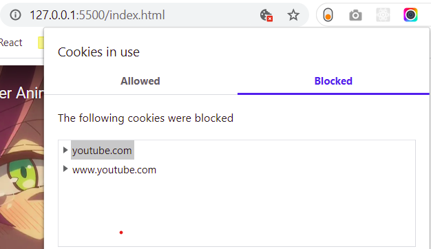

# CSRF

In a CSRF attack, an innocent end user is tricked by an attacker into submitting a web request that they did not intend.
There are many ways in which a malicious website can transmit such request; specially-crafted image tags, hidden forms, and JavaScript XMLHttpRequests, for example, can all work without the user's interaction or even knowledge.
This may cause actions to be performed on the website that can include inadvertent client or server data leakage, change of session state, or manipulation of an end user's account.

A general property of web browsers is that they will automatically and invisibly include any cookies used by a given domain in any web request sent to that domain. This property is exploited by CSRF attacks in that any web request made by a browser will automatically include any cookies (including session cookies and others) created when a victim logs into a website. In the event that a user is tricked into inadvertently submitting a request through their browser these automatically included cookies will cause the forged request to appear real to the web server and it will perform any appropriately requested actions including returning data, manipulating session state, or making changes to the victim's account.
<br>

# Example of CSRF

SOP protects against csrf through javascript (Fetch API, Ajax , XhttpsRequest) but embedding is allowed in SOP through ``,`<iframe>`, `<form>` etc. and Cross-Site-Request-Fogery is done through them leveraging the fact that browsers automatically send any cookies used by a given domain in any web request sent to that domain.

### GET request

<hr style=" float: left;" width="20%"><br>

Suppose, someone includes an image that isn’t really an image (for example in an unfiltered chat or forum), instead it really is a request to your bank’s server to withdraw money (not idempotent request):

```

```

Now, if you are logged into your bank account and your cookies are still valid (and there is no other validation), you will transfer money as soon as you load the HTML that contains this image.

### POST request

<hr style=" float: left;" width="20%"><br>

For endpoints that require a POST request, it's possible to programmatically trigger a `<form>` submit (perhaps in an invisible `<iframe>`) when the page is loaded:

```
<form action="https://bank.example.com/withdraw" method="POST">
  <input type="hidden" name="account" value="bob">
  <input type="hidden" name="amount" value="1000000">
  <input type="hidden" name="for" value="mallory">
</form>
<script>window.addEventListener('DOMContentLoaded', (e) => { document.querySelector('form').submit(); }</script>


```

### Other HTTP methods

<hr style=" float: left;" width="20%"><br>

Let’s assume the vulnerable bank uses PUT that takes a JSON block as an argument. Such requests can be executed with JavaScript embedded into an exploit page:

```
<script>
function put() {
    var x = new XMLHttpRequest();
    x.open("PUT","http://bank.com/transfer.do",true);
    x.setRequestHeader("Content-Type", "application/json");
    x.send(JSON.stringify({"acct":"BOB", "amount":100}));
}
</script>

<body onload="put()">
```

Fortunately, this request will not be executed by modern web browsers thanks to same-origin policy restrictions. This restriction is enabled by default unless the target web site explicitly opens up cross-origin requests from the attacker’s (or everyone’s) origin by using CORS with the following header:

```
Access-Control-Allow-Origin: *
```

<br>

# Prevention from CSRF

There are a few techniques that should be used to prevent this from happening:

- GET endpoints should be idempotent —actions that cause change should require sending a POST (or other HTTP method) request. POST endpoints should not interchangeably accept GET requests with parameters in the query string.

- A CSRF token should be included in `<form>` elements via a hidden input field. This token should be unique per user and stored (for example, in a cookie) such that the server can look up the expected value when the request is sent. For all non-GET requests that have the potential to perform an action, this input field should be compared against the expected value. If there is a mismatch, the request should be aborted.

- This method of protection relies on an attacker being unable to predict the user's assigned CSRF token. The token should be regenerated on sign-in.

- Cookies that are used for sensitive actions (such as session cookies) should have a short lifetime with the SameSite attribute set to Strict or Lax. (See SameSite cookies below). In supporting browsers, this will have the effect of ensuring that the session cookie is not sent along with cross-site requests and so the request is effectively unauthenticated to the application server.

- Both CSRF tokens and SameSite cookies should be deployed. This ensures all browsers are protected and provides protection where SameSite cookies cannot help (such as attacks originating from a separate subdomain).

<br>

# Same-Site Cookie Attribute ( Done by Server Side )

With the help of Same-Site cookie attribute developers can now instruct browsers to control whether cookies are sent along with the request initiated by third party websites - by using the SameSite cookie attribute, which is a more practical solution than denying the sending of cookies.

Same-Site cookie Attribute has three values : `Lax Strict None`

- Strict :

  When the SameSite attribute is set as Strict, cookies will only be sent in a first-party context and not be sent along with requests initiated by third party websites.

  Setting a cookie as Strict can affect browsing experience negatively. For example, if you click on a link that points to a Facebook profile page, and if `Facebook.com` has set its cookie as SameSite=Strict, you cannot continue navigation on Facebook (view the Facebook page) unless you log in to Facebook again. The reason for this is because Facebook`s cookie was not sent by this request.

- Lax :

  When you set SameSite attribute to Lax, the cookie will be only sent in first-party context and along with the GET request initiated by third party website that causes a top level navigation.
  That is when a user is navigating to the origin site from an external site (e.g. if following a link).

  Resources can be loaded by iframe, img tags, and script tags. These requests can also operate as GET requests, but none of them cause TOP LEVEL navigation. Basically, they don't change the URL in your address bar. Because these GET requests do not cause a TOP LEVEL navigation, thus cookies set to Lax won't be sent with them.

  Chrome 80 made this the default behavior if the SameSite attribute is not specified.
  Before chrome 80 it was none.

- None :

  The browser sends the cookie with both cross-site and same-site requests. The Secure attribute must also be set when SameSite=None.

  Cookies will be sent in all contexts, i.e in responses to both first-party and cross-origin requests.If SameSite=None is set, the cookie Secure attribute must also be set (or the cookie will be blocked).

  This table shows what cookies are sent with cross-origin requests. As you can see cookies with none as same-site attribute indicated by ‘none’ are always sent. Strict cookies are never sent. Lax cookies are only send with a top-level get request

  <table>
  <tbody>
  <tr style="height: 15px;">
  <td style="width: 129px; height: 15px;"><strong>Request Type</strong></td>
  <td style="width: 347.417px; height: 15px;"><strong>Example Code</strong></td>
  <td style="width: 226.583px; height: 15px;"><strong>Cookies sent</strong></td>
  </tr>
  <tr style="height: 15px;">
  <td style="width: 129px; height: 15px;">Link</td>
  <td style="width: 347.417px; height: 15px;"><span>&lt;a href="..."&gt;&lt;/a&gt;</span></td>
  <td style="width: 226.583px; height: 15px;">None, Lax</td>
  </tr>
  <tr style="height: 15px;">
  <td style="width: 129px; height: 15px;">Perender</td>
  <td style="width: 347.417px; height: 15px;"><span>&lt;link rel="prerender" href=".."/&gt;</span></td>
  <td style="width: 226.583px; height: 15px;">None, Lax</td>
  </tr>
  <tr style="height: 15px;">
  <td style="width: 129px; height: 15px;">Form GET</td>
  <td style="width: 347.417px; height: 15px;"><span>&lt;form method="GET" action="..."&gt;</span></td>
  <td style="width: 226.583px; height: 15px;">None, Lax</td>
  </tr>
  <tr >
  <td>Form POST</td>
  <td><span>&lt;form method="POST" action="..."&gt;</span></td>
  <td>None</td>
  </tr>
  <tr>
  <td>iframe</td>
  <td><span>&lt;iframe src="..."&gt;&lt;/iframe&gt;</span></td>
  <td>None</td>
  </tr>
  <tr>
  <td>AJAX</td>
  <td><span>$.get("...")</span></td>
  <td>None</td>
  </tr>
  <tr>
  <td>Image</td>
  <td><span>&lt;img src="..."&gt;</span></td>
  <td>None</td>
  </tr>
  </tbody>
  </table>

  <br>

### Example

<hr style=" float: left;" width="20%"><br>

- Let's say a user is on `site-a.com` and clicks on a link to go to `site-b.com`. This is a cross-site request. This is a top-level navigation and is a GET request, so Lax cookies are sent to `site-b.com`. However, Strict cookies are not sent because it is, after all, a cross-site request.
- The user is on `site-a.com` and there is an iframe in which `site-b.com` is loaded. This is a cross-site request, but it's not a top-level navigation (the user is still on `site-a.com`, i.e. the URL bar doesn't change when the iframe is loaded). Therefore neither Lax nor Strict cookies are sent to `site-b.com`.
- The user is on `site-a.com` which POSTs a form to `site-b.com`. This is a cross-site request, but the method (POST) is unsafe. It doesn't meet the criteria for Lax cookies going cross-site, so neither Lax nor Strict cookies are sent to `site-b.com`.

### Usecase

<hr style=" float: left;" width="20%"><br>

As you would expect strict mode gives better security, but breaks some functionality. Links to protected resources (e.g. `https://github.com/Sjord/privateProject`) won’t work from other sites. Even if you are logged in to GitHub and would have access to this private project, your strict cookies won’t be sent to GitHub when coming from another site. With lax mode this still works, while providing decent security by blocking cross site post requests.

Tracking cookies ( fonts and scripts from Google, and share buttons from Facebook and Twitter) have samesite attribute as none to send cookies both cross-site and same-site requests.

When requesting data from another site, any cookies that you had on that site are also sent with the request. If you are logged in to Facebook, your session cookie is sent to Facebook whenever you visit a page that contains a Facebook share button. This can be used by Facebook to track which pages you are visiting.
In this scenario, the cookies sent to Facebook are called third-party cookies with `SameSite=None`. The user and the web page are the first and second party. Any other site is a third party.

<br>

# CSRF token (Done by Server Side)

A CSRF token is a random, hard-to-guess string. On a page with a form you want to protect, the server would generate a random string, the CSRF token, add it to the form as a hidden field and also remember it somehow, either by storing it in the session or by setting a cookie containing the value.

```
<form action="https://example.com/tweet" method="POST">
  <input type="hidden" name="csrf-token" value="nc98P987bcpncYhoadjoiydc9ajDlcn">
  <input type="text" name="tweet">
  <input type="submit">
</form>
```

When the user submits the form, the server simply has to compare the value of the posted field csrf-token (the name doesn’t matter) with the CSRF token remembered by the server. If both strings are equal, the server may continue to process the form. Otherwise the server should immediately stop processing the form and respond with an error.<br>
This implies even if cookies are sent with cross-site requests without the correct/matching crsf token those request would be rejected.

## How does this work?

- Copying the static source code from our page to a different website would be useless, because the value of the hidden field changes with each user. Without the bad guy’s website knowing the current user’s CSRF token our server would always reject the POST request.

- Because the bad guy’s malicious page is loaded by user’s browser from a different domain , the bad guy has no chance to code a JavaScript, that loads the content and user’s current CSRF token from our website. That is because web browsers don’t allow cross-domain AJAX requests by default (SOP).

- For the bad guy to make a csrf request he/she has to include the user's csrf token in form. The user's csrf token can be stored either in server side session data or cookie.

  - CSRF token as Server-Side Session data :
    The bad guy has no way to access the user's server side session data

  - CSRF token as Cookie :
    Since only the user's browser and the website which set the cookie can view the cookie contents ( as SOP prevents an attacker from reading or setting cookies on the target domain ) therefore the bad guy will never know the csrf token.<br>
    This is known as Double Submit Cookie.

<br>

# Blocking Cross-site Requests ( Done by Client Side )

Browser extensions such as RequestPolicy (for Mozilla Firefox) or uMatrix (for both Firefox and Google Chrome/Chromium) can prevent CSRF by providing a default-deny policy for cross-site requests. However, this can significantly interfere with the normal operation of many websites.
For example youtube videos, google maps, facebook share buttons are all cross-site request. They will all stop working.

Browser extensions for blocking third party cookies can also prevent CSRF but again the user expirience would be affected as many third party cookies are used for integrating third party APIs like Google Maps, Gmail, Facebook share button, Twitter, Youtube.

Stopping crossite request would break the website dramatically while stopping third party cookies would break some funtionality.
For example denying all cross-site request through browser extensions would make the iframe of a youtube video empty while blocking third party cookies will break the watch later functionality of the iframe.

### Example

<hr style=" float: left;" width="20%"><br>

- Suppose we embed an iframe of a youtube video

  ```
  <iframe width="560" height="315" src="https://www.youtube.com/embed/lJ0yjsbDQ00" frameborder="0"
        allow="accelerometer; autoplay; clipboard-write; encrypted-media; gyroscope; picture-in-picture"
        allowfullscreen>
    </iframe>
  ```

- When third party cookies of youtube are allowed then the `Watch later` feature works just fine.

   

- When we third party cookies of youtube the `Watch later` feature gives error.

   

   

<br><br>

# CSRF Summary + Doubts

1. SOP disallowing fetch/ajax/Xhttp and CORS providing relaxation
2. For html tags like `<iframe>, , <form>` that can make cross-site request and are allowed by SOP we have
   - SameSite attribute
   - CSRF tokens

<br>

## Why CSRF Token?

<hr style=" float: left;" width="20%"><br>

Implementing CSRF token is lot of work and overhead as compared to samesite approach. So why is it still considered ? There are still some cons to samesite

- Are you sure no forms use GET to perform an operation that changes state of your site.

- SameSite will only work for browsers that implement this feature. So far, very few do. Unless you want to throw everybody who uses a slightly older browser under the bus, you will still need to implement an old fashioned CSRF-token.

- If you need more fine-grained control, this will not be enough. If you run a system that displays untrusted user content, like a forum, you don't want requests originating from user posts to be treated as valid. If someone posts a link to `http://myforum.com/?action=delete_everything` you don't want that to delete anything just because a user clicks it. With a traditional CSRF-token, you can control exactly when it is used. With a same-site cookie, you can not as session cookie will be sent because that request is originating from your domain.

- If you have an XSS vulnerability, no CSRF protection in this world will save you. The same-site cookie does nothing to protect you from ordinary XSS attacks. If a hacker manages to fool your site to echo out script from the URL on your site, it will be executed as coming from your origin (after all, it is), and thus session cookies will still be sent with all requests the injected script makes to your domain.

<br>

## A Solution approach

<hr style=" float: left;" width="20%"><br>

If a website is willing to break links directed to it, they can simply set SameSite=Strict for all cookies, and be safe. Alternatively, it’s still reasonable to use the CSRFToken approach to stopping these types of attacks, if you have the engineering skills to ensure it’s implemented correctly.
The vast majority of sites are likely to want to have the best of both worlds of course. SameSite=Lax is liable to become the go to solution to CSRF in most cases due to its support for link clicking (a very important feature of the internet).

Two Approaches using same-site attribute

1. Implement cookie classes
1. Audit the entire site to ensure that no malicious action can be performed via a GET request.

### Cookie Classes

<hr style=" float: left;" width="20%"><br>

Sites may simply implement two cookies for access to resources as part of a valid session.

One cookie, a `“read”` cookie with `Same-Site=Lax` which allows the owner of the cookie to access and read resources on the site which belong to them (or to which they are otherwise permitted).<br>
Another a session `“write”` cookie with `Same-Site=Strict` for performing actions/updates/changes to resources under the control of a given account.

In this way, websites may very quickly and easily ensure that all form/logic handlers are protected against CSRF by simply checking for the presence of a valid write cookie before any action will be performed other than reading allowed resources.

### Make Sure GET are idempotent

<hr style=" float: left;" width="20%"><br>

Sites can make their session cookie with `Same-Site=Lax` but they have to audit the entire site to ensure that no malicious action can be performed via a GET request.
