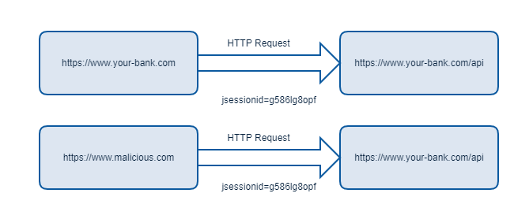
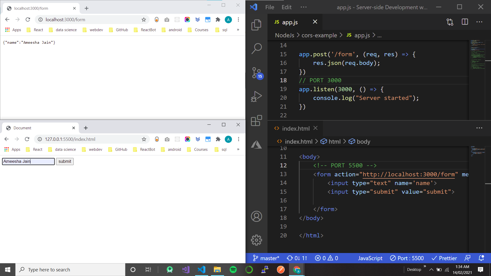

# SOP Same-Origin Policy

The same-origin policy is a critical security mechanism that restricts how a document or script loaded from one origin can interact with a resource from another origin.

Under the policy, a web browser permits scripts contained in a first web page to access data in a second web page, but only if both web pages have the same origin.

# Origin

Tells where a request orignates from.
An origin is defined as a combination of URI scheme, host name, and port number.
Two URLs have the same origin if the protocol, port (if specified), and host are the same for both.
It can be defined by a tuple of three parameters- Protocal, Host Name , Port Number

The following table gives examples of origin comparisons with the URL `http://store.company.com/dir/page.html:`

| URL                                               | Outcome     | Reason                                         |
| ------------------------------------------------- | ----------- | ---------------------------------------------- |
| `http://store.company.com/dir2/other.html`        | Same origin | Only the path differs                          |
| `http://store.company.com/dir/inner/another.html` | Same origin | Only the path differs                          |
| `https://store.company.com/page.html`             | Failure     | Different protocol                             |
| `http://store.company.com:81/dir/page.html`       | Failure     | Different port (http:// is port 80 by default) |
| `http://news.company.com/dir/page.html`           | Failure     | Different host                                 |

<br>

# Need for SOP

This mechanism bears a particular significance for modern web applications that extensively depend on HTTP cookies to maintain authenticated user sessions, as servers act based on the HTTP cookie information to reveal sensitive information or take state-changing actions. A strict separation between content provided by unrelated sites must be maintained on the client-side to prevent the loss of data confidentiality or integrity.
The same-origin policy protects against reusing authenticated sessions across origins.
<br>

### Example 1

<hr width='50%' style=" float: left;" ><br>

The following example illustrates a potential security risk that could arise without the same-origin policy.

- Assume that a user is visiting a banking website and doesn't log out.
- Then, the user goes to another site that has malicious JavaScript code that requests data from the banking site
- Since browsers are required to tag along authentication details such as session cookies and platform-level kinds of the Authorization request header to the banking site based on the domain of the banking site.
- And because the user is still logged in on the banking site, the malicious code could do anything the user could do on the banking site
- For example, it could get a list of the user's last transactions, create a new transaction, etc

### Eaxmple 2

<hr width='50%' style=" float: left;" ><br>

For any HTTP request to a particular domain, browsers automatically attach any cookies bounded to that domain.
<br>
<br>

<br>
<br>
It doesn't matter if a request originates from `your-bank.com` or `malicous.com`. As long as the request goes to `your-bank.com`, the cookies stored for `your-bank.com` would be used. As you can see, without the Same-Origin Policy, a Cross-Site Request Forgery (CSRF) attack can be relatively simple, assuming that authentication is based solely on a session cookie. That’s one of the reasons the SOP was introduced.

<br>

### Eaxmple 3

<hr width='50%' style=" float: left;" ><br>

You, like many websites, may use cookies to keep track of authentication or session info. Those cookies are bounded to a certain domain when they are created. On every HTTP call to that domain, the browser will attach the cookies that were created for that domain. This is on every HTTP call, which could be for static images, HTML pages, or even AJAX calls.

This means when you log into `https://examplebank.com`, a cookie is stored for `https://examplebank.com`. If that bank is a single-page React app, they may have created a REST API at `https://examplebank.com/api` for the SPA to communicate via AJAX.

This is due to the browser behavior of automatically attaching any cookies bounded to `https://examplebank.com` for any HTTP calls to that domain, including AJAX calls from `https://evilunicorns.com` to `https://examplebank.com`. By restricting HTTP calls to only ones to the same origin (i.e. the browser tab’s domain), same-origin policy closes some hacker backdoors such as around Cross-Site Request Forgery (CSRF) (Although not all. Mechanisms like CSRF tokens are still necessary).

<br>

# Scope of SOP / Cross-origin network access

The same-origin policy controls interactions between two different origins, such as when you use `XMLHttpRequest` or an `` element. These interactions are typically placed into three categories:

- Cross-origin `writes` are typically allowed.
  Examples are links, redirects, and form submissions. Some HTTP requests require preflight.
  

- Cross-origin `embedding` is typically allowed.

  - JavaScript with `<script src="…"></script>`. Error details for syntax errors are only available for same-origin scripts.

  - CSS applied with `<link rel="stylesheet" href="…">`. Due to the relaxed syntax rules of CSS, cross-origin CSS requires a correct Content-Type header.`

  - Images displayed by ``.
  - Media played by `<video>` and `<audio>`.
  - External resources embedded with `<object>` and `<embed>`.
  - Fonts applied with @font-face. Some browsers allow cross-origin fonts, others require same-origin.
  - Anything embedded by `<iframe>`. Sites can use the X-Frame-Options header to prevent cross-origin framing.

- Cross-origin `reads` are typically disallowed.
  - `Fetch`, `XMLHttpRequest`, `Ajax` are blocked by Same-Origin Policy.

<br>

# Cross-Origin Data Storage Access

Access to data stored in the browser such as Web Storage and IndexedDB are separated by origin. Each origin gets its own separate storage, and JavaScript in one origin cannot read from or write to the storage belonging to another origin.

Cookies use a separate definition of origins. A page can set a cookie for its own domain or any parent domain, as long as the parent domain is not a public suffix.

The browser will make a cookie available to the given domain including any sub-domains, no matter which protocol (HTTP/HTTPS) or port is used. When you set a cookie, you can limit its availability using the Domain, Path, Secure, and HttpOnly flags. When you read a cookie, you cannot see from where it was set. Even if you use only secure https connections, any cookie you see may have been set using an insecure connection

# Doubts

### Doubt 1 - In laymans term what is allowed and bloacked by sop?

<hr width='50%' style=" float: left;" ><br>

A web page may freely embed cross-origin images, stylesheets, scripts, iframes, and videos. Certain "cross-domain" requests, notably `Ajax` requests, are forbidden by default by the same-origin security policy.

For security reasons, **browsers restrict cross-origin HTTP/HTTPS requests initiated from scripts**. For example, `XMLHttpRequest` and the `Fetch API` follow the same-origin policy.

The CORS mechanism supports secure cross-origin requests and data transfers between browsers and servers. Modern browsers use CORS in APIs such as `XMLHttpRequest` or `Fetch` to mitigate the risks of cross-origin HTTP requests.

### Doubt 2- Why did we get cors error in chatbot wrapper deployed on wordpress?

<hr width='50%' style=" float: left;" ><br>

In the beginning we thought the script hosted on Microsoft storage was giving us the CORS error but scripts can be freely embedded cross-origin.

```
    // ALLOWED BY SOP
    <script src="https://agreeyabotstorage.blob.core.windows.net/chat-wrapper/agreeya_bot.js"></script>

    // NOT ALLOWED BY SOP - CORS ERROR
    fetch("https://aybotazurefunctionapp.azurewebsites.net/api/GenerateAYBotToken?code=DjpE11lNWCsOaKN1OZIUjOHhAPb/4ze6JdCNqGS2Qcddp5VSLeESdQ==");
```

Inside the script we were fetching The token from Azure function endpoint whose origin is not same as the wordpress website. This fetch request is blocked by SOP as its a cross origin fetch request and gave CORS error.

Fetch Request from a script will always show the origin as the domain on which the script is running not its src.
So when this script made a fetch request to https://aybotazurefunctionapp the origin it send was that of https://staging.agreeya.net:8089/
So in order to resolve this issue we can create a whitelist of website origins we want to allow at azure function endpoint.

```
res.header({
        'Access-Control-Allow-Origin': "https://staging.agreeya.net:8089/"
    })
```
