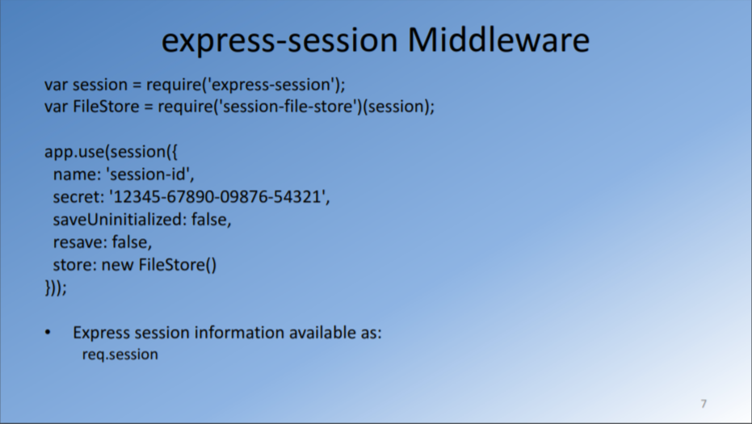
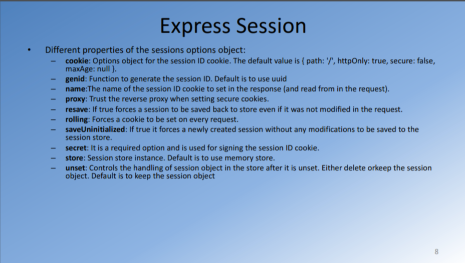

HTTP is stateless; in order to associate a request to any other request, you need a way to store user data between HTTP requests. Cookies and URL parameters are both suitable ways to transport data between the client and the server. But they are both readable and on the client side. Sessions solve exactly this problem. You assign the client an ID and it makes all further requests using that ID. Information associated with the client is stored on the server linked to this ID.

Where is the session data stored? It depends on how you set up the express-session module.

It can store session data in

- memory, not meant for production
- a database like MySQL or Mongo
- a memory cache like Redis or Memcached

All solutions store the session id in a cookie, and keep the data server-side. The client will receive the session id in a cookie, and will send it along with every HTTP request.

We’ll reference that server-side to associate the session id with the data stored locally.

MemoryStore is the default store for storing sessions, it requires no special setup on your part, it’s the simplest thing but it’s meant only for development purposes.Everytime server restarts or crahses sesson data is lost.

The best choice is a memory cache like Redis, for which you need to setup its own infrastructure.
