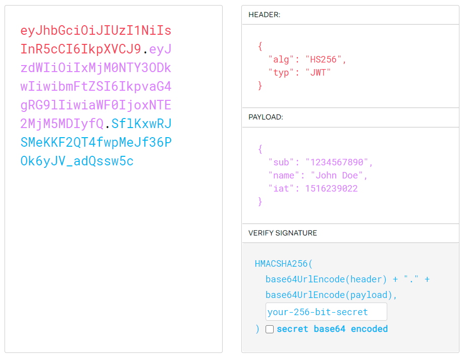

## JWT

JSON Web Token (JWT) is an open standard (RFC 7519) that defines a compact and self-contained way for securely transmitting information between parties as a JSON object. This information can be verified and trusted because it is digitally signed. JWTs can be signed using a secret (with the HMAC algorithm) or a public/private key pair using RSA or ECDSA.

In its compact form, JSON Web Tokens consist of three parts separated by dots (.), which are:

- Header
- Payload
- Signature

Therefore, a JWT typically looks like the following.
xxxxx.yyyyy.zzzzz



### HEADER

The header typically consists of two parts: the type of the token, which is JWT, and the signing algorithm being used, such as HMAC SHA256 or RSA.

For example:

```
{
  "alg": "HS256",
  "typ": "JWT"
}
```

Then, this JSON is Base64Url encoded to form the first part of the JWT.

### Payload

The second part of the token is the payload, which contains the claims. Claims are statements about an entity (typically, the user) and additional data.

```
{
    _id: '600b31de1fc58333cc11a1b1',
    iat: 1611348015,
    exp: 1611351615
}
```

The payload is then Base64Url encoded to form the second part of the JSON Web Token.

### Signature

To create the signature part you have to take the encoded header, the encoded payload, a secret, the algorithm specified in the header, and sign that.

```
HMACSHA256(
  base64UrlEncode(header) + "." +
  base64UrlEncode(payload),
  secret)
```

The signature is the most important part of the JWT structure. The header and payload can easily be decoded, but not the signature. The reason why is because it checks two things; first verify the header and payload has not been altered, and secondly check the private key is valid to make sure the sender is who it is.

```
let data = base64UrlEncode(header) + "." + base64UrlEncode(payload)
// Creates a signature
HMACSHA256(data, secret)
// Signature key
AflKxwRJSMeKKF2QT4fwpMeJf36POk6yJV_adQssw5c
```

In short, if either the header, payload or private key changes along the way, the verification process will fail thus the token is not equal to the one that was initially created.

## Working of JWT

The most common approach of authentication is to store the user in a session on the server. A session is a temporary file to make data accessible across pages on a website such as making sure the user can access a web resource. However, with JWT, we don’t need to manage sessions on the server anymore because the server only cares if the incoming request is valid, and comes from the right person.
Here’s four steps showing how JWT works in practice without needing to use the sessions on the server.

- User logs in with username and password
- If credentials are correct, server creates a signed JWT which says who the user is.
- User wants to access home page
- Verify the JWT signature is valid, if true, grant access.


<br><br>

Whenever the user wants to access a protected route or resource, the user agent should send the JWT, typically in the Authorization header using the Bearer schema. The content of the header should look like the following:

```
Authorization: Bearer <token>

```

- This can be, in certain cases, a stateless authorization mechanism. The server's protected routes will check for a valid JWT in the Authorization header, and if it's present, the user will be allowed to access protected resources. If the JWT contains the necessary data, the need to query the database for certain operations may be reduced, though this may not always be the case.
- If the token is sent in the Authorization header, Cross-Origin Resource Sharing (CORS) won't be an issue as it doesn't use cookies.

## Example - jsonwebtoken

This is a short example to show how to create a JWT, and also what happens if we try to verify a signature that has exceeded an expiration time (6 seconds).

```
const jwt =  require('jsonwebtoken');
const private_key = 'pizza1234';
const payload = { username: 'john', email: 'john@gmail.com' };
// Create a JSON Web Token (JWT)
const token = jwt.sign(payload, private_key, {expiresIn: '5s'});
console.log(token);
// After 6s: verify signature (it will fail) TokenExpiredError: jwt expired
setTimeout(() => {
  const data = jwt.verify(token, private_key);
  console.log(data);
}, 6000)
```

## Passport - JWT strategy (passport-jwt)

JWT authentication strategy takes two parameters.

```
new JWT(options, verify)
```

### options

options is an object literal containing options to control how the token is extracted from the request or verified.

- secretOrKey is a string or buffer containing the secret (symmetric) or PEM-encoded public key (asymmetric) for verifying the token's signature. `REQUIRED` unless secretOrKeyProvider is provided.

- secretOrKeyProvider is a callback in the format function secretOrKeyProvider(request, rawJwtToken, done), which should call done with a secret or PEM-encoded public key (asymmetric) for the given key and request combination. done accepts arguments in the format function done(err, secret). Note it is up to the implementer to decode rawJwtToken. REQUIRED unless secretOrKey is provided.

- jwtFromRequest `REQUIRED` Function that accepts a request as the only parameter and returns either the JWT as a string or null.

- issuer: If defined the token issuer (iss) will be verified against this value.
- audience: If defined, the token audience (aud) will be verified against this value.
- algorithms: List of strings with the names of the allowed algorithms. For instance, ["HS256", "HS384"].
- ignoreExpiration: if true do not validate the expiration of the token.
- passReqToCallback: If true the request will be passed to the verify callback. i.e. verify(request, jwt_payload, done_callback).
- jsonWebTokenOptions: passport-jwt is verifying the token using `jsonwebtoken`. Pass here an options object for any other option you can pass the jsonwebtoken verifier. (i.e maxAge)

### verify

verify is a function with the parameters verify(jwt_payload, done)

- jwt_payload is an object literal containing the decoded JWT payload.
- done is a passport error first callback accepting arguments done(error, user, info)

An example configuration which reads the JWT from the http Authorization header with the scheme 'bearer':

```
var JwtStrategy = require('passport-jwt').Strategy,
    ExtractJwt = require('passport-jwt').ExtractJwt;
var opts = {}
opts.jwtFromRequest = ExtractJwt.fromAuthHeaderAsBearerToken();
opts.secretOrKey = 'secret';
passport.use(new JwtStrategy(opts, function(jwt_payload, done) {
    User.findOne({id: jwt_payload.sub}, function(err, user) {
        if (err) {
            return done(err, false);
        }
        if (user) {
            return done(null, user);
        } else {
            return done(null, false);
            // or you could create a new account
        }
    });
}));
```

### Extracting the JWT from the request

There are a number of ways the JWT may be included in a request. In order to remain as flexible as possible the JWT is parsed from the request by a user-supplied callback passed in as the jwtFromRequest parameter. This callback, from now on referred to as an extractor, accepts a request object as an argument and returns the encoded JWT string or null.
<br>
A number of extractor factory functions are provided in passport-jwt.ExtractJwt. These factory functions return a new extractor configured with the given parameters.

- fromHeader(header_name) creates a new extractor that looks for the JWT in the given http header
- fromBodyField(field_name) creates a new extractor that looks for the JWT in the given body field. You must have a body parser configured in order to use this method.
- fromUrlQueryParameter(param_name) creates a new extractor that looks for the JWT in the given URL query parameter.
- fromAuthHeaderWithScheme(auth_scheme) creates a new extractor that looks for the JWT in the authorization header, expecting the scheme to match auth_scheme.
- fromAuthHeaderAsBearerToken() creates a new extractor that looks for the JWT in the authorization header with the scheme 'bearer'
- fromExtractors([array of extractor functions]) creates a new extractor using an array of extractors provided. Each extractor is attempted in order until one returns a token.

- custom extractor - If the supplied extractors don't meet your needs you can easily provide your own callback. For example, if you are using the cookie-parser middleware and want to extract the JWT in a cookie you could use the following function as the argument to the jwtFromRequest option:

```
var cookieExtractor = function(req) {
    var token = null;
    if (req && req.cookies)
    {
        token = req.cookies['jwt'];
    }
    return token;
};
```

### Authenticate requests

Use passport.authenticate() specifying 'JWT' as the strategy.

```
app.post('/profile', passport.authenticate('jwt', { session: false }),
    function(req, res) {
        res.send(req.user.profile);
    }
);
```

## Doubt 1- How is signature created??? Whats that HMAC?

HMAC stands for Keyed-Hashing for Message Authentication. It's a message authentication code obtained by running a cryptographic hash function (like MD5, SHA1, and SHA256) over the data (to be authenticated) and a shared secret key. HMAC is specified in RFC 2104.
<br>
HMACs are almost similar to digital signatures. They both enforce integrity and authenticity. They both use cryptographic keys. And they both employ hash functions. The main difference is that digital signatures use asymmetric keys, while HMACs use symmetric keys.

```
Formula for HMAC:
HMAC = hashFunc(secret key + message)

```

### Symmetric key encryption

Symmetric key encryption is a type of encryption that makes use of a single key for both the encryption and decryption process. Some of the encryption algorithms that use symmetric keys include: AES (Advanced Encryption Standard), Blowfish, DES (Data Encryption Standard), Triple DES, Serpent, and Twofish.

### Asymmetric key encryption

Asymmetric key encryption, on the other hand, makes use of two keys. A private key and a public key. The public key is used for encrypting, while the private key is used for decrypting. Two of the most widely used asymmetric key algorithms are: RSA and DSA.
