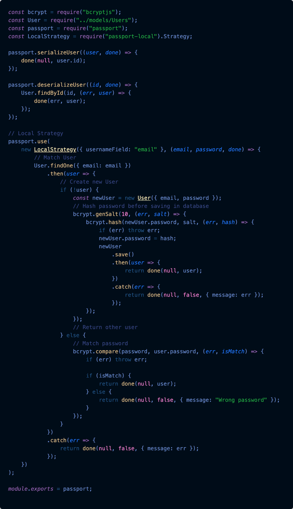

## Overview

Passport is authentication middleware for Node. It is designed to serve a singular purpose: authenticate requests.

In modern web applications, authentication can take a variety of forms. Traditionally, users log in by providing a username and password. With the rise of social networking, single sign-on using an OAuth provider such as Facebook or Twitter has become a popular authentication method. Services that expose an API often require token-based credentials to protect access.

Passport recognizes that each application has unique authentication requirements. Authentication mechanisms, known as `strategies`, are packaged as individual modules. Applications can choose which strategies to employ, without creating unnecessary dependencies.

## Install

```
npm install passport
```

## Authenticate

Authenticating requests is as simple as calling passport.authenticate() and specifying which strategy to employ.

```
app.post('/login',
  passport.authenticate('local'),
  function(req, res) {
    // If this function gets called, authentication was successful.
    // `req.user` contains the authenticated user.
    res.redirect('/users/' + req.user.username);
  });
```

By default, if authentication fails, Passport will respond with a 401 Unauthorized status, and any additional route handlers will not be invoked. If authentication succeeds, the next handler will be invoked and the req.user property will be set to the authenticated user.

### Redirects

A redirect is commonly issued after authenticating a request.

```
app.post('/login',
  passport.authenticate('local', { successRedirect: '/',
  failureRedirect: '/login'
  })
);
```

In this case, the redirect options override the default behavior. Upon successful authentication, the user will be redirected to the home page. If authentication fails, the user will be redirected back to the login page for another attempt.

### Flash Messages

Redirects are often combined with flash messages in order to display status information to the user.

```
app.post('/login',
  passport.authenticate('local', { successRedirect: '/',
  failureRedirect: '/login',
  failureFlash: true })
);
```

Setting the failureFlash option to true instructs Passport to flash an error message using the message given by the strategy's verify callback, if any. This is often the best approach, because the verify callback can make the most accurate determination of why authentication failed.
<br><br>
Alternatively, the flash message can be set specifically.

```
passport.authenticate('local', { failureFlash:'Invalid username or password ' });
```

A successFlash option is available which flashes a success message when authentication succeeds.

```
passport.authenticate('local', { successFlash: 'Welcome!' });
```

### Disable Sessions

After successful authentication, Passport will establish a persistent login session. This is useful for the common scenario of users accessing a web application via a browser. However, in some cases, session support is not necessary. For example, API servers typically require credentials to be supplied with each request. When this is the case, session support can be safely disabled by setting the session option to false.

```
app.get('/api/users/me',passport.authenticate('basic', { session: false }),
function(req, res) { res.json({ id: req.user.id, username: req.user.username });
});
```

- Note: Using flash messages requires a req.flash() function. Express 2.x provided this functionality, however it was removed from Express 3.x. Use of connect-flash middleware is recommended to provide this functionality when using Express 3.x.

### Custom Callback

If the built-in options are not sufficient for handling an authentication request, a custom callback can be provided to allow the application to handle success or failure.

```

app.get('/login', function(req, res, next) {
  passport.authenticate('local', function(err, user, info) {
    if (err) { return next(err); }
    if (!user) { return res.redirect('/login'); }
    req.logIn(user, function(err) {
      if (err) { return next(err); }
      return res.redirect('/users/' + user.username);
    });
  })(req, res, next);
});
```

In this example, note that authenticate() is called from within the route handler, rather than being used as route middleware. This gives the callback access to the req and res objects through closure.

If authentication failed, user will be set to false. If an exception occurred, err will be set. An optional info argument will be passed, containing additional details provided by the strategy's verify callback.

The callback can use the arguments supplied to handle the authentication result as desired. Note that when using a custom callback, it becomes the application's responsibility to establish a session (by calling req.login()) and send a response.

Calling req.login is important here otherwise req.user will remain undefined and won't be populated.

## Operation

### Login

Passport exposes a login() function on req (also aliased as logIn()) that can be used to establish a login session.

```
req.login(user, function(err) {
  if (err) { return next(err); }
  return res.redirect('/users/' + req.user.username);
});
```

When the login operation completes, user will be assigned to req.user otherwise not.
Also in custom callback method {session:false} option is passed to req.login.
`req.login(user,{session:false} ,err=>{}`

- Note: passport.authenticate() middleware invokes req.login() automatically. This function is primarily used when users sign up, during which req.login() can be invoked to automatically log in the newly registered user.

### Log Out

Passport exposes a logout() function on req (also aliased as logOut()) that can be called from any route handler which needs to terminate a login session. Invoking logout() will remove the req.user property and clear the login session (if any).

```
app.get('/logout', function(req, res){
  req.logout();
  res.redirect('/');
});
```

## Authentication Example with Local Strategy

- When the user submits the login form, a POST request to /login is made resulting in the execution of the passport.authenticate middleware we've set up.
- As the authenticate middleware for that route is configured to handle the local strategy, passport will invoke our implementation of the local strategy.
- Passport takes the req.body.username and req.body.password and passes it to our verification function in the local strategy.
- Now we do our thing: loading the user from the database and checking if the password given matches the one in the database.
- In case of an Error interacting with our database, we need to invoke done(err). When we cannot find the user or the passwords do not watch, we invoke done(null, false). If everything went fine and we want the user to login we invoke done(null, user).
- Calling done will make the flow jump back into passport.authenticate. It's passed the error, user and additional info object (if defined).
- If the user was passed, the middleware will call req.login (a passport function attached to the request).
- This will call our passport.serializeUser method we've defined earlier. This method can access the user object we passed back to the middleware. It's its job to determine what data from the user object should be stored in the session. The result of the serializeUser method is attached to the session as req.session.passport.user = { // our serialised user object // }.
- The result is also attached to the request as req.user.
- Once done, our requestHandler is invoked. In the example the user is redirected to the homepage.



## Verify Callback

Strategies require what is known as a verify callback. The purpose of a verify callback is to find the user that possesses a set of credentials.

When Passport authenticates a request, it parses the credentials contained in the request. It then invokes the verify callback with those credentials as arguments, in this case username and password. If the credentials are valid, the verify callback invokes done to supply Passport with the user that authenticated.

```
return done(null, user);

```

If the credentials are not valid (for example, if the password is incorrect), done should be invoked with false instead of a user to indicate an authentication failure.

```
return done(null, false);
```

An additional info message can be supplied to indicate the reason for the failure. This is useful for displaying a flash message prompting the user to try again.

```
return done(null, false, { message: 'Incorrect password.' });
```

Finally, if an exception occurred while verifying the credentials (for example, if the database is not available), done should be invoked with an error, in conventional Node style.

```
return done(err);
```

An additional info message can be supplied to indicate the reason for the failure. This is useful for displaying a flash message prompting the user to try again.

```
return done(null, false, { message: 'Incorrect password.' });
```

Finally, if an exception occurred while verifying the credentials (for example, if the database is not available), done should be invoked with an error, in conventional Node style.

```
return done(err);
```

- Note that it is important to distinguish the two failure cases that can occur. The latter is a server exception, in which err is set to a non-null value. Authentication failures are natural conditions, in which the server is operating normally. Ensure that err remains null, and use the final argument to pass additional details.

## Parameters

By default, LocalStrategy expects to find credentials in parameters named `username` and `password`. If your site prefers to name these fields differently, options are available to change the defaults.

- When session support is not necessary, it can be safely disabled by setting the session option to false.

```
passport.use(new LocalStrategy({
usernameField: 'email',
passwordField: 'passwd',
session:false
},
function(username, password, done) {
// ...
}
));
```
