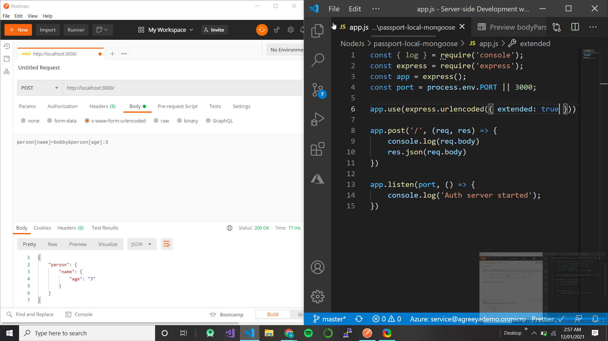
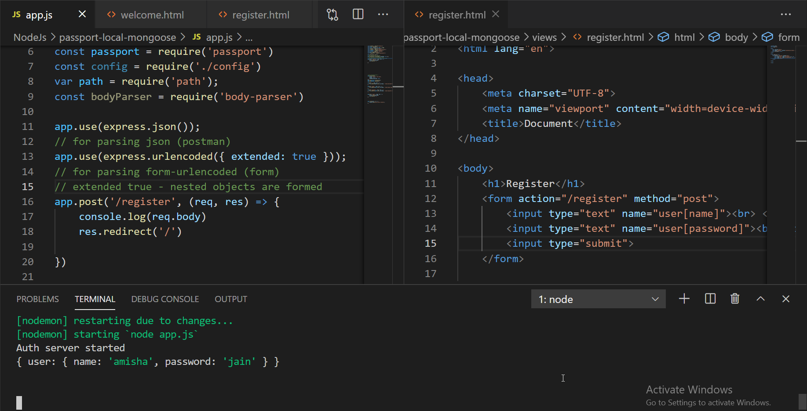
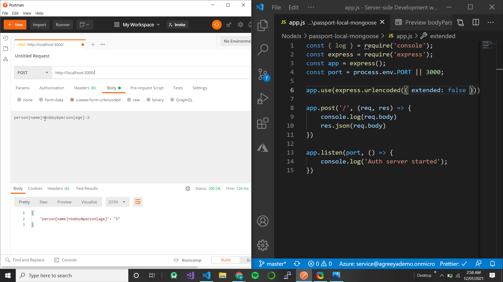
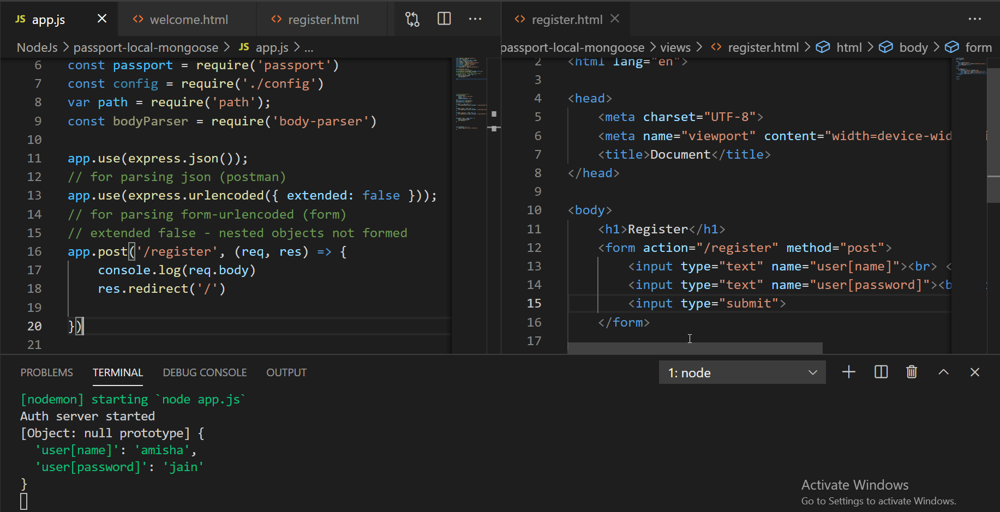

## Doubt 1 express.json() vs bodyParser.json()

express.json() is same as bodyParser.json()

Earlier versions of Express used to have a lot of middleware bundled with it. bodyParser was one of the middlewares that came it. When Express 4.0 was released they decided to remove the bundled middleware from Express and make them separate packages instead. The syntax then changed from app.use(express.json()) to app.use(bodyParser.json()) after installing the bodyParser module.

bodyParser was added back to Express in release 4.16.0, because people wanted it bundled with Express like before. That means you don't have to use bodyParser.json() anymore if you are on the latest release. You can use express.json() instead.

If you go into the file node_module/express/lib/express.js you can see under module dependencies body parser module is already imported

## Doubt 2 what is express.json() and express.urlencoded()

- What is Middleware? It is those methods/functions/operations that are called BETWEEN processing the Request and sending the Response in your application method.

- When talking about express.json() and express.urlencoded() think specifically about POST requests (i.e. the .post request object) and PUT Requests (i.e. the .put request object)

- You DO NOT NEED express.json() and express.urlencoded() for GET Requests or DELETE Requests.

- You NEED express.json() and express.urlencoded() for POST and PUT requests, because in both these requests you are sending data (in the form of some data object) to the server and you are asking the server to accept or store that data (object), which is enclosed in the body (i.e. req.body) of that (POST or PUT) Request

- Express provides you with middleware to deal with the (incoming) data (object) in the body of the request.

  - express.json() is a method inbuilt in express to recognize the incoming Request Object as a JSON Object. This method is called as a middleware in your application using the code:
    `app.use(express.json());`

  - express.urlencoded() is a method inbuilt in express to recognize the incoming Request Object as strings or arrays. It parses incoming requests with urlencoded payloads and is based on body-parser.This method is called as a middleware in your application using the code:
    `app.use(express.urlencoded());`

- ALTERNATIVELY, I recommend using body-parser (it is an NPM package) to do the same thing. It is developed by the same peeps who built express and is designed to work with express. body-parser used to be part of express. Think of body-parser specifically for POST Requests (i.e. the .post request object) and/or PUT Requests (i.e. the .put request object).

- In body-parser you can do

```
// calling body-parser to handle the Request Object from POST requests
var bodyParser = require('body-parser');
// parse application/json, basically parse incoming Request Object as a JSON Object
app.use(bodyParser.json());
// parse application/x-www-form-urlencoded, basically can only parse incoming Request Object if strings or arrays
app.use(bodyParser.urlencoded({ extended: false }));
// combines the 2 above, then you can parse incoming Request Object if object, with nested objects, or generally any type.
app.use(bodyParser.urlencoded({ extended: true }));
```

## Doubt 3 express.urlencoded()

```
var express = require('express')

var app = express()

app.use(express.json()) // for parsing application/json
app.use(express.urlencoded({ extended: true })) // for parsing application/x-www-form-urlencoded

app.post('/profile', function (req, res, next) {
  console.log(req.body)
  res.json(req.body)
})
```

<table>
<thead>
  <tr>
    <th>code</th>
    <th>Now make a POST request to http://localhost:3000/ with header set to ‘content-type: application/x-www-form-urlencoded’<br>form</th>
    <th>Now make a POST request to http://localhost:3000/ with header set to ‘content-type: application/json’<br>req.body</th>
  </tr>
</thead>
<tbody>
  <tr>
    <td>app.use(express.urlencoded({ extended: true }))</td>
    <td>will give output</td>
    <td>{}</td>
  </tr>
  <tr>
    <td>app.use(express.json())</td>
    <td>{}</td>
    <td>will give output</td>
  </tr>
  <tr>
    <td>app.use(express.json()) <br>app.use(express.urlencoded({ extended: true }))</td>
    <td>will give output</td>
    <td>will give output</td>
  </tr>
</tbody>
</table>

## Doubt 4 extended property in express.urlencoded({ extended : true/false })

- When extended property is set to true, the URL-encoded data will be parsed with the qs library.

- when extended property is set to false, the URL-encoded data will instead be parsed with the querystring library.

### The differences between parsing with `qs library` vs `querystring library`

- qs library allows you to create a nested object from your query string.

```
var qs = require("qs")
var result = qs.parse("person[name]=bobby&person[age]=3")
console.log(result) // { person: { name: 'bobby', age: '3' } }
```

- query-string library does not support creating a nested object from your query string.

```
var queryString = require("query-string")
var result = queryString.parse("person[name]=bobby&person[age]=3")
console.log(result) // { 'person[age]': '3', 'person[name]': 'bobby' }
```

## qs / true




## query-string / false



