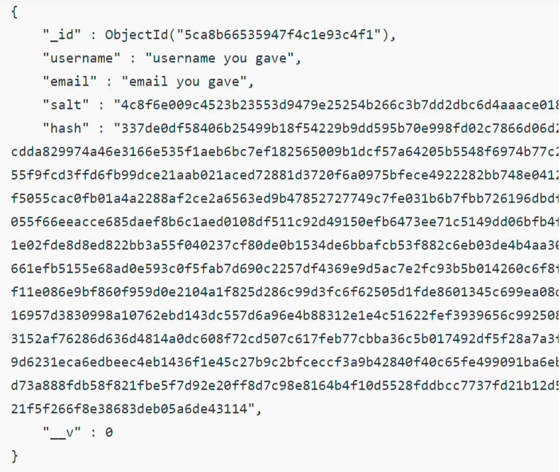

Passport is the authentication middleware for Node. It is designed to serve a singular purpose which is to authenticate requests. It is not practical to store user password as the original string in the database but it is a good practice to hash the password and then store them into the database. But with passport-local-mongoose you don’t have to hash the password using the crypto module, passport-local-mongoose will do everything for you. If you use passport-local-mongoose this module will auto-generate salt and hash fields in the DB. You will not have a field for the password, instead, you will have salt and hash.

## Why salting of password is needed

If the user simply hashes their password and if two users in the database have the same password, then they’ll have the same hash. And if any one of the passwords is hacked then the hacker can access every account using the same password because users with the same password will have the same hash fields.
So before we hash it, we prepend a unique string. Not a secret, just something unique. so the hash is completely different for every salt.

- Installing dependencies
  `npm install passport mongoose passport-local-mongoose`
- First you need to plugin Passport-Local Mongoose into your schema model/user.js

```
const mongoose = require('mongoose');
const Schema = mongoose.Schema;
const passportLocalMongoose = require('passport-local-mongoose');

const User = new Schema({});

User.plugin(passportLocalMongoose);

module.exports = mongoose.model('User', User);
```

- Passport-Local Mongoose will add a username, hash and salt field to store the username, the hashed password and the salt value.

- Additionally Passport-Local Mongoose adds some methods to your Schema. <a href="#method">See instance and static methods</a>

- Intialising passport in app.js

```
app.use(passport.initialize());
app.use(passport.session());
```

- Simplified Passport/Passport-Local Configuration

```
// requires the model with Passport-Local Mongoose plugged in
const User = require('./models/user');

//local strategy
var LocalStrategy = require('passport-local').Strategy


// use static authenticate method of model in LocalStrategy
passport.use(new LocalStrategy(User.authenticate()));

// use static serialize and deserialize of model for passport session support
passport.serializeUser(User.serializeUser());
passport.deserializeUser(User.deserializeUser());
```

or

```
const User = require('./models/user');

// CHANGE: USE "createStrategy" INSTEAD OF "authenticate"
passport.use(User.createStrategy());

passport.serializeUser(User.serializeUser());
passport.deserializeUser(User.deserializeUser());
```

- create route/user.js

```
// importing modules
const express = require('express');
const router = express.Router();

// importing User Schema
const User = require('../model/user');

router.post('/login', function(req, res) {

    Users=new User({email: req.body.email, username : req.body.username});

          User.register(Users, req.body.password, function(err, user) {
            if (err) {
              res.json({success:false, message:"Your account could
              not be saved. Error: ", err})
            }else{
              res.json({success: true, message: "Your account has
               been saved"})
            }
          });
});
```

- See in the above code we did not define our password in New user. Instead, we use the password with the User.Register() which is a passport-local-mongoose function. Now if you check your database for your saved user, it will be like below



- You can notice that there is no field for password at all, instead passport-local-mongoose created salt and hash for you, that too you didn’t have to define salt and hash fields in your schema. Passport-local-mongoose will keep your username unique, ie if username already exist it will give “UserExistsError”.

- for login route to authenticate

```
app.post('/login', passport.authenticate('local', { failureRedirect: '/' }),  function(req, res) {
	console.log(req.user)
	res.redirect('/dashboard');
});

```

<div id="method">

## Instance methods

- setPassword(password, [cb])<br>
  Sets a user password. Does not save the user object. If no callback cb is provided a Promise is returned.
- changePassword(oldPassword, newPassword, [cb])<br>
  Changes a user's password hash and salt, resets the user's number of failed password attempts and saves the user object (everything only if oldPassword is correct). If no callback cb is provided a Promise is returned. If oldPassword does not match the user's old password, an IncorrectPasswordError is passed to cb or the Promise is rejected.
- authenticate(password, [cb])<br>
  Authenticates a user object. If no callback cb is provided a Promise is returned.
- resetAttempts([cb])<br>
  Resets a user's number of failed password attempts and saves the user object. If no callback cb is provided a Promise is returned. This method is only defined if options.limitAttempts is true.

### Callback Arguments

- err<br>
  null unless the hashing algorithm throws an error
- thisModel<br>
  the model getting authenticated if authentication was successful otherwise false
- passwordErr<br>
  an instance of AuthenticationError describing the reason the password failed, else undefined.

Using setPassword() will only update the document's password fields, but will not save the document. To commit the changed document, remember to use Mongoose's document.save() after using setPassword().

## Static methods

Static methods are exposed on the model constructor. For example to use createStrategy function use

```
const User = require('./models/user');
User.createStrategy();
```

- authenticate() Generates a function that is used in Passport's LocalStrategy
- serializeUser() Generates a function that is used by Passport to serialize users into the session
- deserializeUser() Generates a function that is used by Passport to deserialize users into the session
- register(user, password, cb) Convenience method to register a new user instance with a given password. Checks if username is unique. See login example.
- findByUsername() Convenience method to find a user instance by it's unique username.
- createStrategy() Creates a configured passport-local LocalStrategy instance that can be used in passport.

## Hash Algorithm

Passport-Local Mongoose use the pbkdf2 algorithm of the node crypto library. Pbkdf2 was chosen because platform independent (in contrary to bcrypt). For every user a generated salt value is saved to make rainbow table attacks even harder.

</div>
