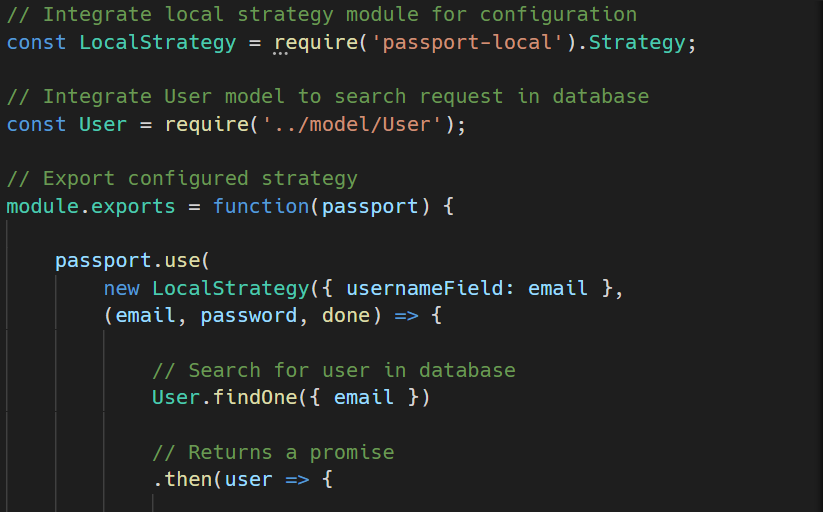
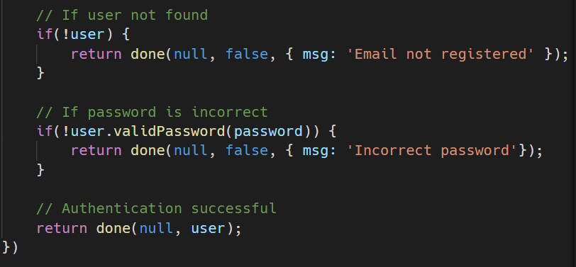
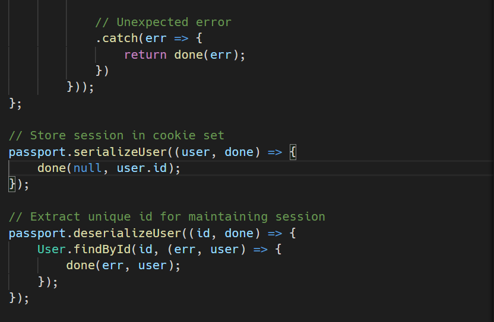
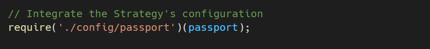
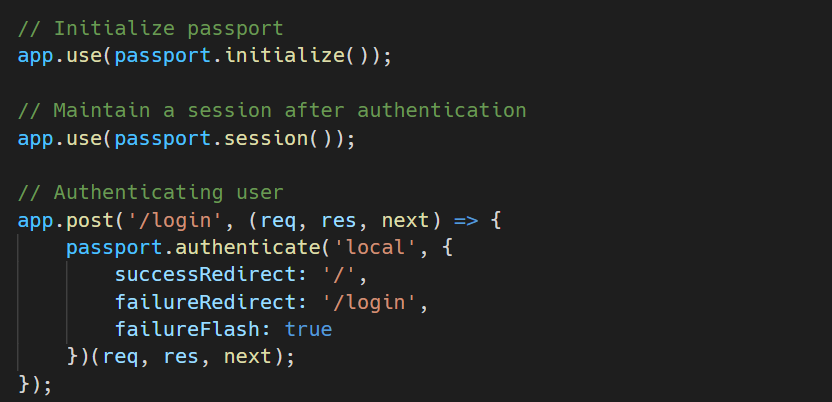
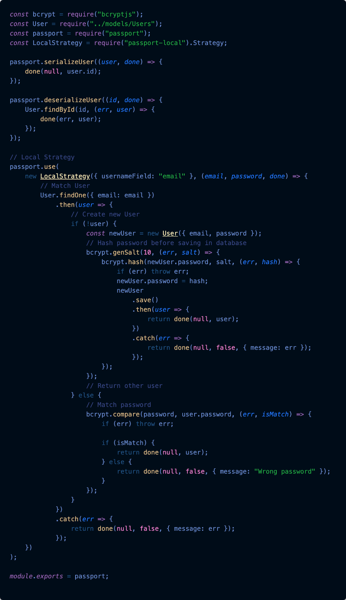
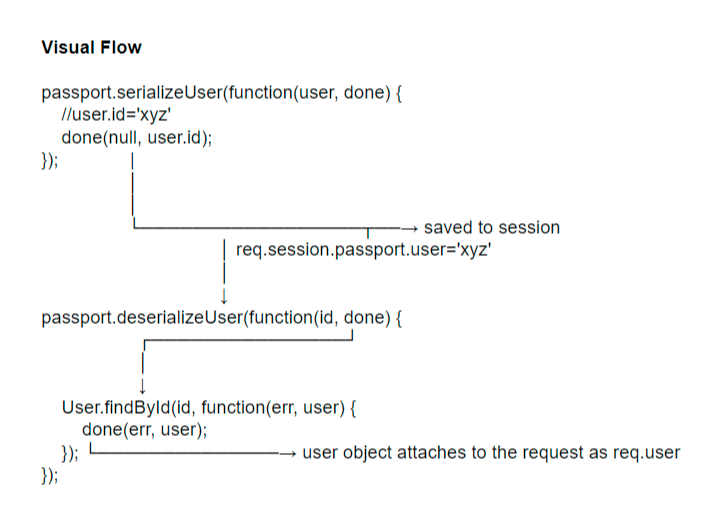
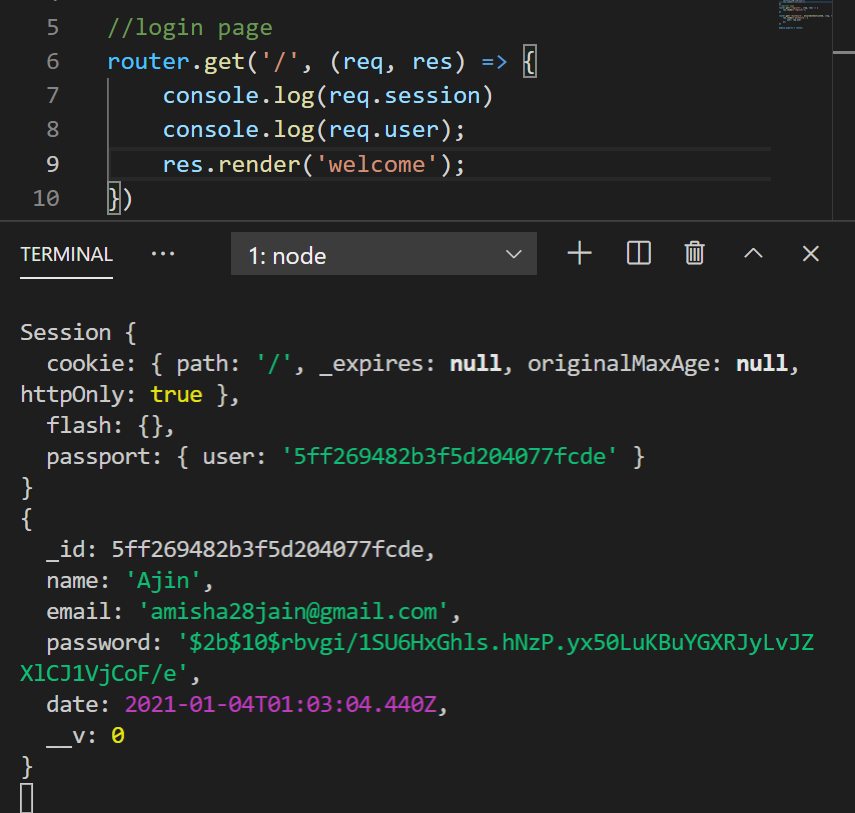
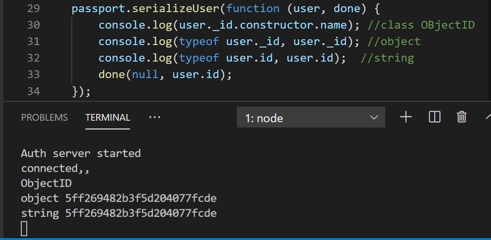

## What is Passport.js?

It is an authentication middleware for Express-based applications using Node.js. Being a middleware, it has access to request, and response objects, and can manipulate them in request-response cycle. It is extremely easy to integrate into any application.
Put simply, Passport has only one thing to do- authenticate requests.

- Authentication middleware for Node.js
- Modular, flexible
- Supports various strategies for authentication:
  - Local strategy
  - OpenID
  - Oauth (Facebook, Twitter, G+ etc.) single sign-on
- Supports Sessions (optional)
- Installing
  npm install passport --save
- A strategy is an “authentication mechanism” or a “way to verify”, and packaged as individual modules, so that only required dependencies are installed in projects.

### Local Strategy

<hr>

<div style='width:50%; float:left'>
Example 1 - We will be using the Local Strategy to authenticate requests using username and password.

1. To add an authentication layer to the application, install passport and passport-local, and integrate these modules in the “root” file or “entry point” file.

`npm install passport passport-local`

2. Next, we have to configure our Local strategy to be able to use it. The configuration of the strategy involves a verify callback which takes the username, and password entered by the user as arguments, and verify these credentials with the database (in our case, MongoDB).

Let’s understand the above code snippet, which is in a file called passport.js, residing in directory config

<ol>
<li> The passport-local module is made available for strategy configuration.</li>
<li> The User model of MongoDB is integrated next (stored in directory model as User.js) The model facilitates the handling of data (like searching, adding, retrieving etc.). In our case, we want the model to search for a given set of credentials in MongoDB.</li>
<li> Since modularity in programming leads to a more clean, and maintainable code, we have configured the strategy in a separate file, and then exported it in “root” file as a function.</li>
<li> The strategies, and their configurations are supplied via use(). Therefore, in passport.use(), an object LocalStrategy is instantiated, with the first parameter specifying the type of username (here, email), and the second parameter being the verify callback, which actually verifies the credentials.</li>
<li> The credentials (inputted by user i.e., email and password) are passed automatically (in form of req.body.username and req.body.password) to the verify callback once the request to authenticate the user is made.</li>
<li> The next few lines of code performs the task of verifying the passed email, and password with those stored in MongoDB.
<li>Note that in the verify callback, another callback done() is passed. It is sufficient to know that this function is called internally (by Passport) once the verification process is completed, or an error is generated (like server error). This function done() tells whether the authentication succeeded, or failed!</li>
<li>Once the authentication process is successful, a session can be created very easily. Creating a session means the user doesn’t need to login every time he visits a web app or service on the web. This is achieved using serializeUser and deserializeUser in Passport. Once a request is authenticated, a constant session is maintained via a cookie set in the user’s browser. The cookies only contain a small amount of data i.e., user ID (which is generated itself in MongoDB).
So, next time the user visits the application, the appropriate ID is retrieved by the browser, and the user, thus, does not need to login again.</li>
<li>IMPORTANT: It is not always necessary to set up a session, because while working on an API layer in application, the user needs to verify at every stage to protect access (normally done using tokens, like JWTs).
</li>
</ol>

The only thing left is to set up a route handler. Setting up a route handler essentially means instructing the application to start the authentication process once credentials are filled and submitted via a form present on a certain route (example, /login).
This step is quite easy, because we have already configured the strategy.

<ol>
<li> First the Local Strategy config. is made available (stored in /config/passport.js).</li>
<li>The Passport layer should be initialized first before use. So, passport.initialize() middleware is used.</li>
<li>Since we have chosen to maintain an active session after successful authentication, the passport.session() middleware is also needed. <strong>It is important</strong> to note that the passport session must be used after the express.session(), to ensure sessions in proper order!</li>
<li>At the end, we have set up a route handler, which uses passport.authenticate() for verification. The first argument to authenticate() is the strategy used, and the second argument is an object specifying where to redirect, should the authentication succeeds or fails.</li>
<li>The failureFlash property ensures an error message is shown on the redirected route in case the authentication fails.
Remember the message to be shown is provided by the verify callback i.e., { msg }.</li>
</ol>

So, put short, the following three pieces need to be configured to use Passport for authentication:

<ol>
<li> Authentication strategies </li>
<li> Application middleware </li>
<li> Sessions (optional) </li>
</ol>
</div>

<div style='margin-top:400px; width:50%; float:right'>



</div>

<div style='margin-top:100px; width:50%; float:right'>


</div>

<div style="float:left;">
<hr>
Example 2- Passport.js can handle many different authentication flows and provides a strategy for most of them. Each strategy is packaged in its npm package. The local strategy uses a basic authentication flow based on a username/password. We are going to use bcrypt.js to encrypt our users' passwords

```
yarn add passport-local
yarn add bcryptjs
```

Our local strategy is a little bit adjusted as we use email instead of username. We then check for the existence of the provided email and proceed as follows:

- If we can’t find a user, a new user is created with the encrypted password.
- If a user is found, the encrypted provided password is compared against the encrypted password in the database

We also need to add serialization and deserialization functionality for Passport.js to use.

<div style='width:50%; float:left'>

- **serializeUser**: The user id (we provide as the second argument of the done function) is saved in the session and is later used to retrieve the whole object via the deserializeUser function.serializeUser determines which data of the user object should be stored in the session. The result of the serializeUser method is attached to the session as req.session.passport.user = {}. In our case, it would be (as we provide the user id as the key) req.session.passport.user = {id: 'xyz'}. serializeUser is triggered after a successful invocation of our local strategy and when we are going to log the user in as part of passport.login, to which we pass the user object generated by the local strategy. If you want to know more.
- **deserializeUser**: The first argument of deserializeUser corresponds to the key of the user object that was given to the done function (see serializeUser). So, the whole object is retrieved with the help of that key. That key here is the user id (key can be any key of the user object i.e., name, email, etc.). In deserializeUser that key is matched with the in-memory array/database or any data resource. The fetched object is attached to the request object as req.user. deserializeUser is called when we send a request with an attached session Cookie containing a serialized user id.
</div>
<div style='width:50%; float:right'>
    
</div>

## Control Flow -

### DIFFERENT PARTS IN USING PASSPORT.JS

There are three main parts in using passport.js:

- Requiring the module and using its passport.initialize() and passport.session() middleware with express.
- Configuring passport with at least one Strategy and setting up passport's serializeUser and deserializeUser methods.
  Specifying a route which uses the passport.authenticate middleware to actually authenticate a user.

The example clearly demonstrates the different items. We wont go over it again.

### AUTHENTICATION REQUEST FLOW

The following happens when a user tries the authenticate via the /login route:

- When the user submits the login form, a POST request to /login is made resulting in the execution of the passport.authenticate middleware we've set up.
- As the authenticate middleware for that route is configured to handle the local strategy, passport will invoke our implementation of the local strategy.
- Passport takes the req.body.username and req.body.password and passes it to our verification function in the local strategy.
- Now we do our thing: loading the user from the database and checking if the password given matches the one in the database.
- In case of an Error interacting with our database, we need to invoke done(err). When we cannot find the user or the passwords do not watch, we invoke done(null, false). If everything went fine and we want the user to login we invoke done(null, user).
- Calling done will make the flow jump back into passport.authenticate. It's passed the error, user and additional info object (if defined).
- If the user was passed, the middleware will call req.login (a passport function attached to the request).
- This will call our passport.serializeUser method we've defined earlier. This method can access the user object we passed back to the middleware. It's its job to determine what data from the user object should be stored in the session. The result of the serializeUser method is attached to the session as req.session.passport.user = { // our serialised user object // }.
- The result is also attached to the request as req.user.
- Once done, our requestHandler is invoked. In the example the user is redirected to the homepage.

### SUBSEQUENT AUTHENTICATED REQUESTS FLOW

On subsequent request, the following occurs:

- Express loads the session data and attaches it to the req. As passport stores the serialised user in the session, the serialised user object can be found at req.session.passport.user.
- The general passport middleware we setup (passport.initialize) is invoked on the request, it finds the passport.user attached to the session. If is doesn't (user is not yet authenticated) it creates it like req.passport.user = {}.
- Next, passport.session is invoked. This middleware is a Passport Strategy invoked on every request. If it finds a serialised user object in the session, it will consider this request authenticated.
- The passport.session middleware calls passport.deserializeUser we've setup. Attaching the loaded user object to the request as req.user.

### SUMMARY PASSPORT METHODS AND MIDDLEWARE

- **passport.initialize** middleware is invoked on every request. It ensures the session contains a passport.user object, which may be empty.
- **passport.session** middleware is a Passport Strategy which will load the user object onto req.user if a serialised user object was found in the server.
- **passport.deserializeUser** is invoked on every request by passport.session. It enables us to load additional user information on every request. This user object is attached to the request as req.user making it accessible in our request handling.
- Our Local Strategy is only invoked on the route which uses the passport.authenticate middleware.
- Only during this authentication passport.serializeUser is invoked allowing us the specify what user information should be stored in the session.

### OVERVIEW PASSPORT METHODS ATTACHED TO THE REQUEST

To finish an overview of passport methods accessible within request handlers:

- req.login()
- req.logout()
- req.isAuthenticated()
- req.isUnAuthenticated()

## Doubt 1 flow of serialize n deserialize -

- serializeUser- stores the user.id='xyz'
  as a cookie and sessionID `req.session.passport.user='xyz'` during authentication

- deserializeUser- uses the `user.id` (from req.session.passport.user) stored by serialUser to populate `req.user` with all the information from database everytime a request is made.




## Doubt 2 - `user.id` shouldn't it be user.\_id

- `user.id` - gives a string of user id.
- user.\_id - gives a ObjectID of user id.



## Doubt 3 - Control Flow simpliefied

### Authentication request :Register

- Request: POST req.body.`username`,req.body.`password`
- Middleware: passport.authenticate('local')
- Strategy: Local Strategy()
- Verify callback: username and password if matched done(null,`user`)
- Middleware: control back to passport.authenticate('local') calls
- req.login(): a passport function attached to the request calls
- serailizeUser(): starts a session with session id `req.session.passport.user` equal to user.id
  Route Handler: is invoked

### Accessing Resources

- Next Request: session ID is available at `req.session.passport.user`
- passport.initialize(): is invoked on every request. It ensures checks `req.session.passport.user` exists and if not creates it `req.session.passport.user={}`
- passport.session(): is invoked on every request.
- passport.deserializeUser() : is called on every request by `passport.session()` and it populates req.user object.

</div>
