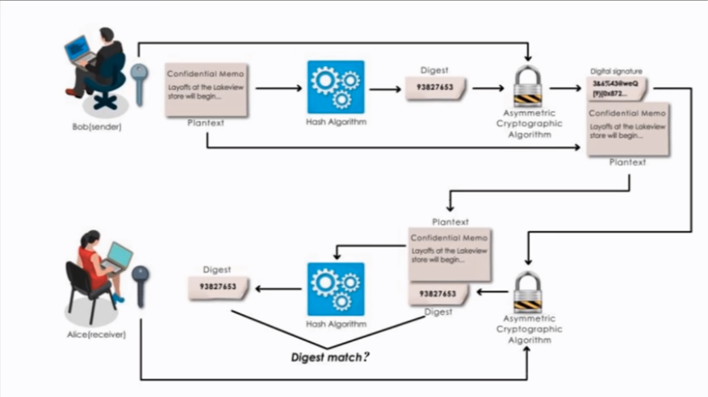
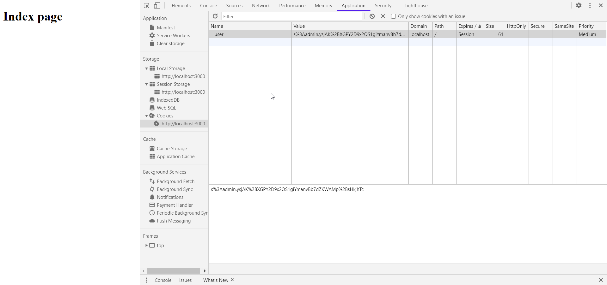

## Cookie-Parser

Parses Cookie header and populate req.cookies with an object keyed by the cookie names. Optionally you may enable signed cookie support by passing a secret string, which assigns req.secret so it may be used by other middleware.

```
npm install cookie-parser
```

```
var express = require('express')
var cookieParser = require('cookie-parser')

var app = express()
app.use(cookieParser())

app.get('/', function (req, res) {
  // Cookies that have not been signed
  console.log('Cookies: ', req.cookies)
})
```

### To enable signed cookies-

- secret: a string or array used for signing cookies. This is optional and if not specified, will not parse signed cookies. If a string is provided, this is used as the secret. If an array is provided, an attempt will be made to unsign the cookie with each secret in order.

- signedCookies(cookies,secret)
  Given an object, this will iterate over the keys and check if any value is a signed cookie. If it is a signed cookie and the signature is valid, the key will be deleted from the object and added to the new object that is returned.

  The secret argument can be an array or string. If a string is provided, this is used as the secret. If an array is provided, an attempt will be made to unsign the cookie with each secret in order.

```
var express = require('express')
var cookieParser = require('cookie-parser')

var app = express()
app.use(cookieParser(secret,options))
app.get('/', function (req, res) {
  // Cookies that have been signed
  console.log('Signed Cookies: ', req.signedCookies)
})
```

## Doubt 1-

1. The value of cookie is encrypted using the secret and its hash is made.
2. The value of cookie sent by the server is the combination of its original value plus the hash.( hash + value )
3. When a request is recieved first its hash and orignal value are extracted.
4. The original value is again encrypted and then hashed.
5. This hash is compared with the hash recieved through the cookie.
6. If the hashes match, integrity of cookie is confirmed else cookie has been tampered with.

this process is exactly like a digital signature


