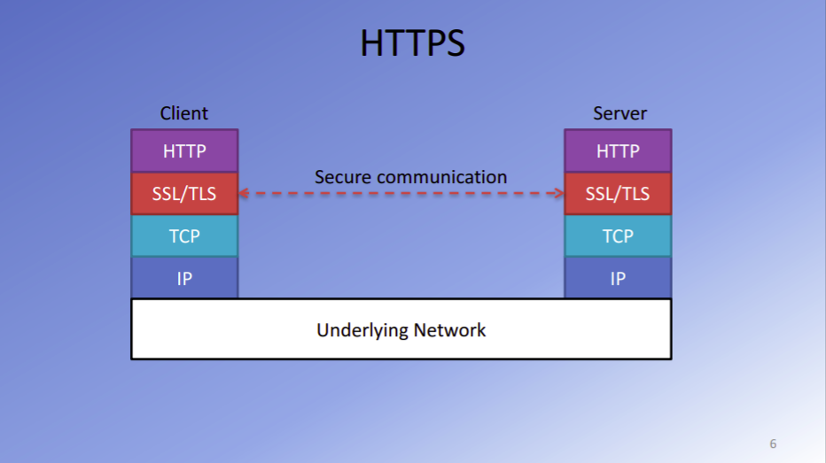

## Symmetric Key Cryptography

 

 
 

- In symmetric key cryptography both sender and reciever have the same secret key.

- When sender wants to send a message, they encrypt the message using a cryptography algorithm, which takes the secret key and message as input.

- Now, this encrypted message will be sent to the channel across to the receiver side.
- If you have a third party malicious user sitting in between and listening and capturing this encrypted message, they would have a hard time decrypting this message because for decrypting an encrypted message secret key will be required.

- On the receiver side, the encrypted message is decrypted by a decryption algorithm, which also takes as the input, the same secret key that was used on the sender side to encrypt the message. Upon decryption, the original message will be retrieved and can be processed on the receiver side.
   

**Problem with symmetric key cryptography** - 
Both the sender and the receiver needs to have access to the same secret key. Now, if the sender and receiver are communicating over an insecure channel, it is going to be difficult for both sides to come to an understanding about the same secret key without disclosing it to others. So this is where another algorithm called public-key cryptography is very useful.

 
 

## Public Key Cryptography

 

 
 

- In public-key cryptography, the idea is that each communitcating party has two different keys.
  A public key that can be widely distributed to anyone that wants to send you a message.
  A private key that is kept secret and not shared with everyone.

- When sender wants to send a message they will encrypt the message using reciever's
  public key using the encryption algorithm.

- Now, once the encrypted message is sent across over the insecure channel to the receiver side, the receiver will then use their private key that only the receiver knows in order to decrypt.

- Thus in public-key cryptography the public key can be widely distributed without any concern across an insecure channel.
   
  Here there is no requirement to share the private key. 
  A third-party intruder that captures encrypted message will find it inordinately difficult to decrypt the message without the private key. 

**Problem with Public key cryptography** - 
Using public-key cryptography for encryption and decryption is an expensive process, that is why we don't use public-key cryptography for their entire communication.
 
Instead, the public-key cryptography is primarily for the sender and the receiver to agree upon the common secret key that the two are going to use.
 
The public-key cryptography can be used to establish the common secret key between the sender and the receiver and then subsequently use symmetric key cryptography for further communication. One protocol that uses this approach is the Secure Sockets Layer and also the Transport Layer security protocols, SSL and TLS

 
 

## Objectives of Cryptography

- First, trying to maintain the privacy of the communication between the sender and the receiver so that no malicious third party can extract the message from the encrypted message.
- Second, we are also trying to maintain integrity, meaning that when the sender sends a message, the receiver will be able to be assured that the message has not being tampered with.
   
   

## SSL / TLS

 

 
 

These cryptography protocols enable secure communication between the sender and the receiver over an insecure network like the Internet. The sender and the receiver will communicate over this Internet using encrypted messages, which only the sender and the receiver can decrypt. This approach, either the SSL or TLS, uses a combination of public-key cryptography together with symmetric key cryptography.
 
 

We are trying to maintain two different things. We are, **First**, trying to maintain the privacy of the communication between the sender and the receiver so that no malicious third party can extract the message from the encrypted message. **Second**, we are also trying to maintain integrity, meaning that when the sender sends a message, the receiver will be able to be assured that the message has not being tampered with.
 
 

## Working of TLS/SSL

 

 
 

- **The 'client hello' message:** The client initiates the handshake by sending a "hello" message to the server. The message will include which TLS version the client supports, the cipher suites supported, and a string of random bytes known as the "client random."

- **The 'server hello' message:** In reply to the client hello message, the server sends a message containing the server's SSL certificate, the server's chosen cipher suite, and the "server random," another random string of bytes that's generated by the server.

- **Authentication:** The client verifies the server's SSL certificate with the certificate authority that issued it. This confirms that the server is who it says it is, and that the client is interacting with the actual owner of the domain.

- **The premaster secret:** The client sends one more random string of bytes, the "premaster secret." The premaster secret is encrypted with the public key and can only be decrypted with the private key by the server. (The client gets the public key from the server's SSL certificate.)

- **Private key used:** The server decrypts the premaster secret.

- **Session keys created:** Both client and server generate session keys from the client random, the server random, and the premaster secret. They should arrive at the same results.

- **Client is ready:** The client sends a "finished" message that is encrypted with a session key.
- **Server is ready:** The server sends a "finished" message encrypted with a session key.
- **Secure symmetric encryption achieved:** The handshake is completed, and communication continues using the session keys.

 
 

### What is a cipher suite?

A cipher suite is a set of encryption algorithms for use in establishing a secure communications connection. (An encryption algorithm is a set of mathematical operations performed on data for making data appear random.) There are a number of cipher suites in wide use, and an essential part of the TLS handshake is agreeing upon which cipher suite will be used for that handshake.

 
 

## HTTPS

 

 
 
The internet is a layered architecture, where the IP and the TCP form the network, and the transport layer which runs on top of the underlying network. 
Now, on top of the transport layer, you have the secure socket layer or the transport layer security lining as a thin layer on top of TCP which ensures secure communication between the client and the server.

 
So, HTTPS essentially involves HTTP plus the use of encryption, decryption supported through SSL and TLS.The SSL/TLS layer has 2 main purposes:

- Verifying that you are talking directly to the server that you think you are talking to

- Ensuring that only the server can read what you send it and only you can read what it sends back
