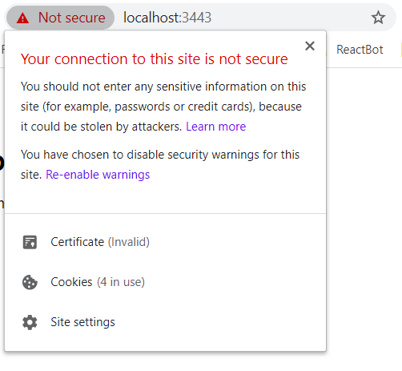

# What is SSL?

SSL, more commonly called TLS, is a protocol for encrypting Internet traffic and verifying server identity. Any website with an HTTPS web address uses SSL/TLS.

 

# What is an SSL certificate?

 

  

SSL certificates are what enable websites to move from HTTP to HTTPS, which is more secure. An SSL certificate is a data file hosted in a website's origin server. SSL certificates make SSL/TLS encryption possible, and they contain the website's public key and the website's identity, along with related information. Devices attempting to communicate with the origin server will reference this file to obtain the public key and verify the server's identity. The private key is kept secret and secure.

 

# Why do websites need an SSL certificate?

A website needs an SSL certificate in order to keep user data secure, verify ownership of the website, prevent attackers from creating a fake version of the site, and gain user trust

- Encryption: SSL/TLS encryption is possible because of the public-private key pairing that SSL certificates facilitate. Clients (such as web browsers) get the public key necessary to open a TLS connection from a server's SSL certificate

- Authentication: SSL certificates verify that a client is talking to the correct server that actually owns the domain. This helps prevent domain spoofing and other kinds of attacks.

- HTTPS: Most crucially for businesses, an SSL certificate is necessary for an HTTPS web address. HTTPS is the secure form of HTTP, and HTTPS websites are websites that have their traffic encrypted by SSL/TLS

 

# What information does an SSL certificate contain?

SSL certificates include:

- The domain name that the certificate was issued for
- Which person, organization, or device it was issued to
- Which certificate authority issued it
- The certificate authority's digital signature
- Associated subdomains
- Issue date of the certificate
- Expiration date of the certificate
- The public key (the private key is kept secret)

The public and private keys used for SSL are essentially long strings of characters used for encrypting and decrypting data. Data encrypted with the public key can only be decrypted with the private key, and vice versa.

 

# How does a website obtain an SSL certificate?

For an SSL certificate to be valid, domains need to obtain it from a certificate authority (CA). A CA is an outside organization, a trusted third party, that generates and gives out SSL certificates. The CA will also digitally sign the certificate with their own private key, allowing client devices to verify it. Most, but not all, CAs will charge a fee for issuing an SSL certificate.

Once the certificate is issued, it needs to be installed and activated on the website's origin server. Web hosting services can usually handle this for website operators. Once it's activated on the origin server, the website will be able to load over HTTPS and all traffic to and from the website will be encrypted and secure.

 

# What is a self-signed SSL certificate?

Technically, anyone can create their own SSL certificate by generating a public-private key pairing and including all the information mentioned above. Such certificates are called self-signed certificates because the digital signature used, instead of being from a CA, would be the website's own private key.

But with self-signed certificates, there's no outside authority to verify that the origin server is who it claims to be. Browsers don't consider self-signed certificates trustworthy and may still mark sites with one as "not secure," despite the https:// URL. They may also terminate the connection altogether, blocking the website from loading.

At the root level of CA self signed certificates are there.

## Making a self signed ssl certificate in nodejs

   

   

- Note : before running second command open private.key in notepad and make sure its encoding is in UTF-8 otherwise command will give error
     

   

Result -
   

   

 

# Doubt 1-

- http

  

- https with CA certified SSL certificate

  

- https with self signed SSL certificate

  
